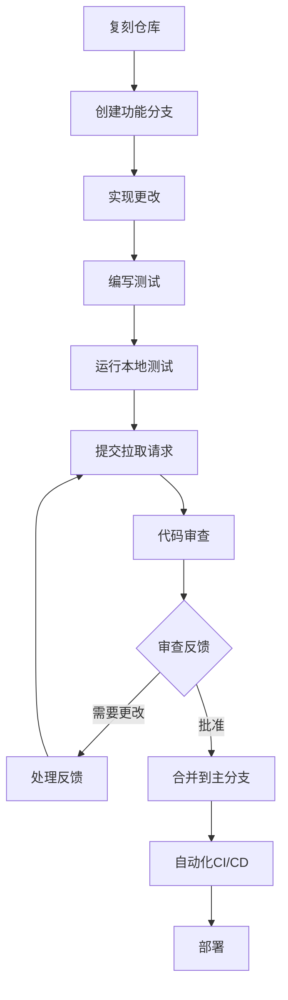

# O-RAN 开源社区资源指南

## 概述
本指南提供关于O-RAN开源社区、论坛和协作平台的全面信息，开发者、研究人员和行业专业人士可以在这些平台上交流、贡献并了解O-RAN技术的最新发展。

## 主要O-RAN开源社区

### 1. O-RAN软件社区(OSC)
```yaml
community_info:
  name: "O-RAN软件社区"
  website: "https://osco.oran.org"
  founded: "2019"
  mission: "加速O-RAN兼容软件的开发和部署"
  
key_projects:
  - oran-ric:
      description: "O-RAN智能控制器实现"
      repositories: ["ric-plt", "ric-app", "ric-helm"]
      license: "Apache 2.0"
      contributors: 150+
  
  - oran-sim:
      description: "O-RAN网络模拟器和测试工具"
      repositories: ["simulator", "test-framework"]
      license: "BSD 3-Clause"
      contributors: 80+

  - oran-doc:
      description: "文档和规范仓库"
      repositories: ["docs", "specifications"]
      license: "知识共享"
      contributors: 200+

membership_tiers:
  platinum_member: "主要电信运营商和设备供应商"
  gold_member: "科技公司和研究机构"
  silver_member: "小型公司和初创企业"
  associate_member: "个人贡献者和学生"
```

### 2. ONAP (开放网络自动化平台)
```yaml
community_info:
  name: "ONAP - 开放网络自动化平台"
  website: "https://www.onap.org"
  founded: "2017"
  integration_with_oran: "与RAN自动化的紧密协作"
  
oran_related_projects:
  - oran-control-loop:
      description: "O-RAN优化的自动化控制回路"
      integration_points: ["近实时RIC", "非实时RIC"]
      use_cases: ["负载均衡", "干扰管理", "能耗优化"]
  
  - oran-policy:
      description: "O-RAN网络的策略管理"
      standards_compliance: ["O-RAN A1接口", "3GPP策略"]
      implementation: "基于XACML的策略引擎"
```

### 3. OpenAirInterface (OAI)
```yaml
community_info:
  name: "OpenAirInterface"
  website: "https://openairinterface.org"
  founded: "2013"
  oran_integration: "O-RAN组件的参考实现"
  
oran_components:
  - oai-ru:
      description: "O-RAN兼容射频单元实现"
      hardware_support: ["Intel FlexRAN", "Xilinx RFSoC"]
      interfaces: ["eCPRI", "IEEE 1588"]
  
  - oai-du:
      description: "O-RAN分布式单元实现"
      split_options: ["选项7.2x", "选项2"]
      virtualization: "基于容器的部署"
  
  - oai-cu:
      description: "O-RAN中央单元实现"
      protocol_support: ["F1-C", "F1-U", "E1"]
```

## 开发者资源和文档

### 1. 技术文档仓库

```markdown
## 关键文档资源

### O-RAN联盟规范
- **O-RAN.WG1**: 架构和用例
- **O-RAN.WG2**: 非实时RIC和A1接口
- **O-RAN.WG3**: 实时RIC和E2接口
- **O-RAN.WG4**: 开放前传接口
- **O-RAN.WG6**: 云化和编排
- **O-RAN.WG7**: 安全

### OSC文档结构
```
oran-documentation/
├── architecture/
│   ├── oran-architecture-overview.md
│   ├── component-interactions.md
│   └── deployment-models.md
├── interfaces/
│   ├── e2-interface-spec.md
│   ├── a1-interface-spec.md
│   └── fronthaul-spec.md
├── development/
│   ├── coding-standards.md
│   ├── testing-guidelines.md
│   └── contribution-process.md
└── deployment/
    ├── installation-guides.md
    ├── configuration-examples.md
    └── troubleshooting.md
```

### 2. 开发环境和工具

```bash
#!/bin/bash
# O-RAN开发环境设置脚本

# 系统要求
MIN_RAM_GB=16
MIN_CPU_CORES=8
DISK_SPACE_GB=100

# 安装先决条件
install_prerequisites() {
    echo "正在安装系统先决条件..."
    
    # Ubuntu/Debian
    if [ -f /etc/debian_version ]; then
        apt-get update
        apt-get install -y docker.io docker-compose git python3 python3-pip
        apt-get install -y build-essential cmake libboost-all-dev
    fi
    
    # CentOS/RHEL
    if [ -f /etc/redhat-release ]; then
        yum install -y docker docker-compose git python3 python3-pip
        yum groupinstall -y "Development Tools"
        yum install -y boost-devel cmake
    fi
}

# 设置Docker环境
setup_docker() {
    echo "正在设置Docker环境..."
    
    # 将用户添加到docker组
    usermod -aG docker $USER
    
    # 启动Docker服务
    systemctl start docker
    systemctl enable docker
    
    # 拉取所需镜像
    docker pull ubuntu:20.04
    docker pull centos:8
    docker pull python:3.9-slim
}

# 克隆O-RAN仓库
clone_repositories() {
    echo "正在克隆O-RAN仓库..."
    
    mkdir -p ~/oran-projects
    cd ~/oran-projects
    
    # OSC仓库
    git clone https://gerrit.oran-osc.org/r/ric-plt
    git clone https://gerrit.oran-osc.org/r/ric-app
    git clone https://gerrit.oran-osc.org/r/simulators
    
    # OAI仓库
    git clone https://gitlab.eurecom.fr/oai/openairinterface5g.git
    git clone https://gitlab.eurecom.fr/oai/openair-cn5g.git
}

# 设置开发工具
setup_dev_tools() {
    echo "正在设置开发工具..."
    
    # 安装VS Code扩展
    code --install-extension ms-python.python
    code --install-extension ms-vscode.cpptools
    code --install-extension redhat.vscode-yaml
    
    # 安装开发工具
    pip3 install pytest pytest-cov black flake8
    npm install -g @commitlint/cli @commitlint/config-conventional
}

# 主设置函数
main() {
    echo "正在设置O-RAN开发环境..."
    
    install_prerequisites
    setup_docker
    clone_repositories
    setup_dev_tools
    
    echo "环境设置完成！"
    echo "请注销并重新登录以应用组成员资格更改。"
}

# 运行设置
main
```

## 协作平台和沟通渠道

### 1. 邮件列表和论坛

```yaml
communication_channels:
  oran-tech-discuss:
    purpose: "技术讨论和架构问题"
    subscription: "tech-discuss-subscribe@lists.oran.org"
    archive: "https://lists.oran.org/pipermail/tech-discuss/"
  
  oran-developers:
    purpose: "开发者聚焦的讨论和代码审查"
    subscription: "developers-subscribe@lists.oran.org"
    archive: "https://lists.oran.org/pipermail/developers/"
  
  oran-wgs:
    purpose: "工作组特定的沟通"
    subscription: "wg1-wg8特定列表"
    archive: "工作组特定档案"
```

### 2. 实时沟通

```yaml
real_time_platforms:
  slack:
    oran_community:
      channels:
        - "#general": "一般社区讨论"
        - "#development": "代码开发和审查"
        - "#testing": "测试和验证讨论"
        - "#documentation": "文档改进"
        - "#wg-specific": "工作组频道"
    oran_osc:
      channels:
        - "#ric-development": "RIC开发讨论"
        - "#simulator-support": "模拟和测试支持"
        - "#deployment-help": "部署协助"
  
  zoom_meetings:
    weekly_sync:
      schedule: "每周三14:00 UTC"
      agenda: "社区更新和协调"
    wg_meetings:
      schedule: "工作组特定时间"
      participation: "对社区成员开放"
```

## 贡献指南和流程

### 1. 代码贡献工作流



### 2. 问题跟踪和管理

```yaml
issue_categories:
  bug_report:
    template:
      - title: "错误的简要描述"
      - description: "问题的详细说明"
      - steps_to_reproduce: "重现问题的明确步骤"
      - expected_behavior: "应该发生什么"
      - actual_behavior: "实际发生了什么"
      - environment: "系统配置和版本"
  
  feature_request:
    template:
      - title: "功能描述"
      - motivation: "为什么需要这个功能"
      - proposed_solution: "功能应该如何工作"
      - alternatives_considered: "评估的其他方法"
      - impact_assessment: "收益和潜在缺点"
  
  documentation_issue:
    template:
      - title: "需要文档改进"
      - section_affected: "哪个文档部分"
      - current_issue: "什么错了或缺失了"
      - suggested_improvement: "建议的更改"
```

## 培训和认证资源

### 1. 在线学习平台

```yaml
learning_resources:
  oran_academy:
    courses:
      - oran_fundamentals:
          duration: "8周"
          topics: ["架构", "接口", "部署"]
          certification: "O-RAN助理"
      
      - oran_developer_track:
          duration: "12周"
          topics: ["RIC开发", "xApps/rApps", "测试"]
          certification: "O-RAN开发者"
      
      - oran_security_specialist:
          duration: "6周"
          topics: ["安全架构", "威胁建模", "合规性"]
          certification: "O-RAN安全专家"
  
  external_platforms:
    coursera:
      courses: ["5G基础知识", "网络功能虚拟化"]
    edx:
      courses: ["软件定义网络", "云计算"]
```

### 2. 实践实验室和沙箱

```yaml
practical_resources:
  oran_testbeds:
    virtual_testbed:
      access: "有批准项目的社区成员"
      resources: ["虚拟机实例", "网络模拟器", "监控工具"]
      support: "社区论坛和文档"
    
    physical_testbed:
      location: "各大学和行业实验室"
      access: "研究合作和伙伴关系"
      equipment: ["商用RAN设备", "SDR平台"]
  
  cloud_sandboxes:
    aws_oran_sandbox:
      credits: "每月$1000用于批准的项目"
      services: ["EC2", "EKS", "S3", "CloudWatch"]
    
    google_cloud_oran:
      credits: "每月$500用于教育用途"
      services: ["计算引擎", "Kubernetes引擎", "监控"]
```

## 社区活动和会议

### 1. 定期社区会议

```yaml
community_events:
  oran_plugfests:
    frequency: "季度"
    duration: "3-5天"
    activities:
      - interoperability_testing: "多厂商集成测试"
      - hackathons: "密集开发冲刺"
      - workshops: "技术深入探讨和培训"
    participation: "对所有社区成员开放"
  
  oran_summits:
    frequency: "半年一次"
    duration: "2-3天"
    format:
      - keynote_presentations: "行业趋势和愿景"
      - technical_sessions: "深入技术讨论"
      - panel_discussions: "关键主题专家小组"
      - networking_events: "社区建设活动"
  
  working_group_meetings:
    frequency: "每周/双周"
    format: "虚拟会议并录制"
    participation: "对工作组成员开放"
    agenda: "技术讨论和决策"
```

## 最佳实践和社区标准

### 1. 代码质量标准

```python
# O-RAN项目的Python代码质量检查器示例
import ast
import sys
from typing import List, Dict, Any

class ORANCodeChecker:
    def __init__(self):
        self.rules = {
            'naming_convention': self.check_naming,
            'docstring_requirement': self.check_docstrings,
            'complexity_limit': self.check_complexity,
            'security_checks': self.check_security
        }
    
    def check_naming(self, node: ast.AST) -> List[str]:
        """检查命名是否遵循O-RAN约定"""
        issues = []
        if isinstance(node, ast.FunctionDef):
            if not node.name.islower() and '_' in node.name:
                issues.append(f"函数 {node.name} 应使用snake_case")
        elif isinstance(node, ast.ClassDef):
            if not node.name[0].isupper():
                issues.append(f"类 {node.name} 应使用PascalCase")
        return issues
    
    def check_docstrings(self, node: ast.AST) -> List[str]:
        """确保所有公共函数都有文档字符串"""
        issues = []
        if isinstance(node, (ast.FunctionDef, ast.ClassDef)):
            if not ast.get_docstring(node):
                issues.append(f"缺少 {node.name} 的文档字符串")
        return issues
    
    def check_complexity(self, node: ast.AST) -> List[str]:
        """检查圈复杂度"""
        issues = []
        if isinstance(node, ast.FunctionDef):
            complexity = self.calculate_complexity(node)
            if complexity > 10:
                issues.append(f"函数 {node.name} 复杂度({complexity})超出限制")
        return issues
    
    def calculate_complexity(self, node: ast.FunctionDef) -> int:
        """计算圈复杂度"""
        complexity = 1
        for child in ast.walk(node):
            if isinstance(child, (ast.If, ast.While, ast.For, ast.ExceptHandler)):
                complexity += 1
        return complexity
    
    def check_security(self, node: ast.AST) -> List[str]:
        """基本安全检查"""
        issues = []
        if isinstance(node, ast.Call):
            if hasattr(node.func, 'attr') and node.func.attr in ['eval', 'exec']:
                issues.append("出于安全原因避免使用eval/exec")
        return issues

# 使用示例
def analyze_code(file_path: str) -> Dict[str, Any]:
    with open(file_path, 'r') as file:
        code = file.read()
    
    tree = ast.parse(code)
    checker = ORANCodeChecker()
    results = {'issues': [], 'stats': {}}
    
    for node in ast.walk(tree):
        for rule_name, rule_func in checker.rules.items():
            issues = rule_func(node)
            results['issues'].extend(issues)
    
    results['stats'] = {
        'total_issues': len(results['issues']),
        'critical_issues': len([i for i in results['issues'] if '安全' in i])
    }
    
    return results

# 示例使用
if __name__ == "__main__":
    if len(sys.argv) > 1:
        results = analyze_code(sys.argv[1])
        print(f"分析完成：发现 {results['stats']['total_issues']} 个问题")
        for issue in results['issues']:
            print(f"  - {issue}")
```

这份全面的指南为开发者和研究人员有效参与和贡献O-RAN开源生态系统提供了所需的一切。