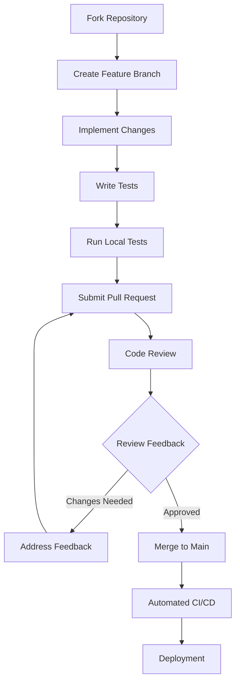

# O-RAN Open Source Community Resources Guide

## Overview
This guide provides comprehensive information about O-RAN open source communities, forums, and collaborative platforms where developers, researchers, and industry professionals can engage, contribute, and stay updated with the latest developments in O-RAN technology.

## Major O-RAN Open Source Communities

### 1. O-RAN Software Community (OSC)
```yaml
community_info:
  name: "O-RAN Software Community"
  website: "https://osco.oran.org"
  founded: "2019"
  mission: "Accelerate the development and deployment of O-RAN compliant software"
  
key_projects:
  - oran-ric:
      description: "O-RAN Intelligent Controller implementations"
      repositories: ["ric-plt", "ric-app", "ric-helm"]
      license: "Apache 2.0"
      contributors: 150+
  
  - oran-sim:
      description: "O-RAN network simulators and testing tools"
      repositories: ["simulator", "test-framework"]
      license: "BSD 3-Clause"
      contributors: 80+

  - oran-doc:
      description: "Documentation and specification repositories"
      repositories: ["docs", "specifications"]
      license: "Creative Commons"
      contributors: 200+

membership_tiers:
  platinum_member: "Major telecom operators and equipment vendors"
  gold_member: "Technology companies and research institutions"
  silver_member: "Smaller companies and startups"
  associate_member: "Individual contributors and students"
```

### 2. ONAP (Open Network Automation Platform)
```yaml
community_info:
  name: "ONAP - Open Network Automation Platform"
  website: "https://www.onap.org"
  founded: "2017"
  integration_with_oran: "Strong collaboration for RAN automation"
  
oran_related_projects:
  - oran-control-loop:
      description: "Automated control loops for O-RAN optimization"
      integration_points: ["Near-RT RIC", "Non-RT RIC"]
      use_cases: ["Load balancing", "Interference management", "Energy optimization"]
  
  - oran-policy:
      description: "Policy management for O-RAN networks"
      standards_compliance: ["O-RAN A1 interface", "3GPP policies"]
      implementation: "XACML-based policy engine"
```

### 3. OpenAirInterface (OAI)
```yaml
community_info:
  name: "OpenAirInterface"
  website: "https://openairinterface.org"
  founded: "2013"
  oran_integration: "Reference implementation for O-RAN components"
  
oran_components:
  - oai-ru:
      description: "O-RAN compliant Radio Unit implementation"
      hardware_support: ["Intel FlexRAN", "Xilinx RFSoC"]
      interfaces: ["eCPRI", "IEEE 1588"]
  
  - oai-du:
      description: "O-RAN Distributed Unit implementation"
      split_options: ["Option 7.2x", "Option 2"]
      virtualization: "Container-based deployment"
  
  - oai-cu:
      description: "O-RAN Centralized Unit implementation"
      protocol_support: ["F1-C", "F1-U", "E1"]
```

## Developer Resources and Documentation

### 1. Technical Documentation Repositories

```markdown
## Key Documentation Resources

### O-RAN Alliance Specifications
- **O-RAN.WG1**: Architecture and Use Cases
- **O-RAN.WG2**: Non-Real-Time RIC and A1 Interface
- **O-RAN.WG3**: Real-Time RIC and E2 Interface
- **O-RAN.WG4**: Open Fronthaul Interfaces
- **O-RAN.WG6**: Cloudification and Orchestration
- **O-RAN.WG7**: Security

### OSC Documentation Structure
```
oran-documentation/
├── architecture/
│   ├── oran-architecture-overview.md
│   ├── component-interactions.md
│   └── deployment-models.md
├── interfaces/
│   ├── e2-interface-spec.md
│   ├── a1-interface-spec.md
│   └── fronthaul-spec.md
├── development/
│   ├── coding-standards.md
│   ├── testing-guidelines.md
│   └── contribution-process.md
└── deployment/
    ├── installation-guides.md
    ├── configuration-examples.md
    └── troubleshooting.md
```

### 2. Development Environments and Tools

```bash
#!/bin/bash
# O-RAN Development Environment Setup Script

# System Requirements
MIN_RAM_GB=16
MIN_CPU_CORES=8
DISK_SPACE_GB=100

# Install prerequisites
install_prerequisites() {
    echo "Installing system prerequisites..."
    
    # Ubuntu/Debian
    if [ -f /etc/debian_version ]; then
        apt-get update
        apt-get install -y docker.io docker-compose git python3 python3-pip
        apt-get install -y build-essential cmake libboost-all-dev
    fi
    
    # CentOS/RHEL
    if [ -f /etc/redhat-release ]; then
        yum install -y docker docker-compose git python3 python3-pip
        yum groupinstall -y "Development Tools"
        yum install -y boost-devel cmake
    fi
}

# Setup Docker environment
setup_docker() {
    echo "Setting up Docker environment..."
    
    # Add user to docker group
    usermod -aG docker $USER
    
    # Start Docker service
    systemctl start docker
    systemctl enable docker
    
    # Pull required images
    docker pull ubuntu:20.04
    docker pull centos:8
    docker pull python:3.9-slim
}

# Clone O-RAN repositories
clone_repositories() {
    echo "Cloning O-RAN repositories..."
    
    mkdir -p ~/oran-projects
    cd ~/oran-projects
    
    # OSC repositories
    git clone https://gerrit.oran-osc.org/r/ric-plt
    git clone https://gerrit.oran-osc.org/r/ric-app
    git clone https://gerrit.oran-osc.org/r/simulators
    
    # OAI repositories
    git clone https://gitlab.eurecom.fr/oai/openairinterface5g.git
    git clone https://gitlab.eurecom.fr/oai/openair-cn5g.git
}

# Setup development tools
setup_dev_tools() {
    echo "Setting up development tools..."
    
    # Install VS Code extensions
    code --install-extension ms-python.python
    code --install-extension ms-vscode.cpptools
    code --install-extension redhat.vscode-yaml
    
    # Install development utilities
    pip3 install pytest pytest-cov black flake8
    npm install -g @commitlint/cli @commitlint/config-conventional
}

# Main setup function
main() {
    echo "Setting up O-RAN development environment..."
    
    install_prerequisites
    setup_docker
    clone_repositories
    setup_dev_tools
    
    echo "Environment setup complete!"
    echo "Please logout and login again to apply group membership changes."
}

# Run setup
main
```

## Collaboration Platforms and Communication Channels

### 1. Mailing Lists and Forums

```yaml
communication_channels:
  oran-tech-discuss:
    purpose: "Technical discussions and architecture questions"
    subscription: "tech-discuss-subscribe@lists.oran.org"
    archive: "https://lists.oran.org/pipermail/tech-discuss/"
  
  oran-developers:
    purpose: "Developer-focused discussions and code reviews"
    subscription: "developers-subscribe@lists.oran.org"
    archive: "https://lists.oran.org/pipermail/developers/"
  
  oran-wgs:
    purpose: "Working group specific communications"
    subscription: "wg1-wg8 specific lists"
    archive: "Working group specific archives"
```

### 2. Real-time Communication

```yaml
real_time_platforms:
  slack:
    oran_community:
      channels:
        - "#general": "General community discussions"
        - "#development": "Code development and reviews"
        - "#testing": "Testing and validation discussions"
        - "#documentation": "Documentation improvements"
        - "#wg-specific": "Working group channels"
    oran_osc:
      channels:
        - "#ric-development": "RIC development discussions"
        - "#simulator-support": "Simulation and testing support"
        - "#deployment-help": "Deployment assistance"
  
  zoom_meetings:
    weekly_sync:
      schedule: "Every Wednesday 14:00 UTC"
      agenda: "Community updates and coordination"
    wg_meetings:
      schedule: "Working group specific times"
      participation: "Open to community members"
```

## Contribution Guidelines and Processes

### 1. Code Contribution Workflow



### 2. Issue Tracking and Management

```yaml
issue_categories:
  bug_report:
    template:
      - title: "Brief description of the bug"
      - description: "Detailed explanation of the issue"
      - steps_to_reproduce: "Clear steps to reproduce the problem"
      - expected_behavior: "What should happen"
      - actual_behavior: "What actually happens"
      - environment: "System configuration and versions"
  
  feature_request:
    template:
      - title: "Feature description"
      - motivation: "Why this feature is needed"
      - proposed_solution: "How the feature should work"
      - alternatives_considered: "Other approaches evaluated"
      - impact_assessment: "Benefits and potential drawbacks"
  
  documentation_issue:
    template:
      - title: "Documentation improvement needed"
      - section_affected: "Which documentation section"
      - current_issue: "What's wrong or missing"
      - suggested_improvement: "Proposed changes"
```

## Training and Certification Resources

### 1. Online Learning Platforms

```yaml
learning_resources:
  oran_academy:
    courses:
      - oran_fundamentals:
          duration: "8 weeks"
          topics: ["Architecture", "Interfaces", "Deployment"]
          certification: "O-RAN Associate"
      
      - oran_developer_track:
          duration: "12 weeks"
          topics: ["RIC Development", "xApps/rApps", "Testing"]
          certification: "O-RAN Developer"
      
      - oran_security_specialist:
          duration: "6 weeks"
          topics: ["Security Architecture", "Threat Modeling", "Compliance"]
          certification: "O-RAN Security Professional"
  
  external_platforms:
    coursera:
      courses: ["5G for Everyone", "Network Functions Virtualization"]
    edx:
      courses: ["Software Defined Networking", "Cloud Computing"]
```

### 2. Hands-on Labs and Sandboxes

```yaml
practical_resources:
  oran_testbeds:
    virtual_testbed:
      access: "Community members with approved projects"
      resources: ["VM instances", "Network simulators", "Monitoring tools"]
      support: "Community forum and documentation"
    
    physical_testbed:
      location: "Various university and industry labs"
      access: "Research collaborations and partnerships"
      equipment: ["Commercial RAN equipment", "SDR platforms"]
  
  cloud_sandboxes:
    aws_oran_sandbox:
      credits: "$1000 monthly for approved projects"
      services: ["EC2", "EKS", "S3", "CloudWatch"]
    
    google_cloud_oran:
      credits: "$500 monthly for educational use"
      services: ["Compute Engine", "Kubernetes Engine", "Monitoring"]
```

## Community Events and Conferences

### 1. Regular Community Meetings

```yaml
community_events:
  oran_plugfests:
    frequency: "Quarterly"
    duration: "3-5 days"
    activities:
      - interoperability_testing: "Multi-vendor integration testing"
      - hackathons: "Intensive development sprints"
      - workshops: "Technical deep-dives and training"
    participation: "Open to all community members"
  
  oran_summits:
    frequency: "Twice yearly"
    duration: "2-3 days"
    format:
      - keynote_presentations: "Industry trends and vision"
      - technical_sessions: "Deep technical discussions"
      - panel_discussions: "Expert panels on key topics"
      - networking_events: "Community building activities"
  
  working_group_meetings:
    frequency: "Weekly/Bi-weekly"
    format: "Virtual meetings with recording"
    participation: "Open to working group members"
    agenda: "Technical discussions and decision making"
```

## Best Practices and Community Standards

### 1. Code Quality Standards

```python
# Example Python code quality checker for O-RAN projects
import ast
import sys
from typing import List, Dict, Any

class ORANCodeChecker:
    def __init__(self):
        self.rules = {
            'naming_convention': self.check_naming,
            'docstring_requirement': self.check_docstrings,
            'complexity_limit': self.check_complexity,
            'security_checks': self.check_security
        }
    
    def check_naming(self, node: ast.AST) -> List[str]:
        """Check if naming follows O-RAN conventions"""
        issues = []
        if isinstance(node, ast.FunctionDef):
            if not node.name.islower() and '_' in node.name:
                issues.append(f"Function {node.name} should use snake_case")
        elif isinstance(node, ast.ClassDef):
            if not node.name[0].isupper():
                issues.append(f"Class {node.name} should use PascalCase")
        return issues
    
    def check_docstrings(self, node: ast.AST) -> List[str]:
        """Ensure all public functions have docstrings"""
        issues = []
        if isinstance(node, (ast.FunctionDef, ast.ClassDef)):
            if not ast.get_docstring(node):
                issues.append(f"Missing docstring for {node.name}")
        return issues
    
    def check_complexity(self, node: ast.AST) -> List[str]:
        """Check cyclomatic complexity"""
        issues = []
        if isinstance(node, ast.FunctionDef):
            complexity = self.calculate_complexity(node)
            if complexity > 10:
                issues.append(f"Function {node.name} complexity ({complexity}) exceeds limit")
        return issues
    
    def calculate_complexity(self, node: ast.FunctionDef) -> int:
        """Calculate cyclomatic complexity"""
        complexity = 1
        for child in ast.walk(node):
            if isinstance(child, (ast.If, ast.While, ast.For, ast.ExceptHandler)):
                complexity += 1
        return complexity
    
    def check_security(self, node: ast.AST) -> List[str]:
        """Basic security checks"""
        issues = []
        if isinstance(node, ast.Call):
            if hasattr(node.func, 'attr') and node.func.attr in ['eval', 'exec']:
                issues.append("Avoid using eval/exec for security reasons")
        return issues

# Usage example
def analyze_code(file_path: str) -> Dict[str, Any]:
    with open(file_path, 'r') as file:
        code = file.read()
    
    tree = ast.parse(code)
    checker = ORANCodeChecker()
    results = {'issues': [], 'stats': {}}
    
    for node in ast.walk(tree):
        for rule_name, rule_func in checker.rules.items():
            issues = rule_func(node)
            results['issues'].extend(issues)
    
    results['stats'] = {
        'total_issues': len(results['issues']),
        'critical_issues': len([i for i in results['issues'] if 'security' in i.lower()])
    }
    
    return results

# Example usage
if __name__ == "__main__":
    if len(sys.argv) > 1:
        results = analyze_code(sys.argv[1])
        print(f"Analysis complete: {results['stats']['total_issues']} issues found")
        for issue in results['issues']:
            print(f"  - {issue}")
```

This comprehensive guide provides everything needed for developers and researchers to effectively participate in and contribute to the O-RAN open source ecosystem.