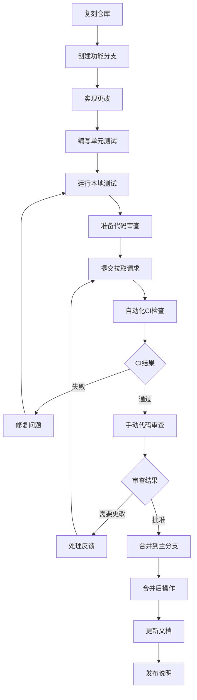

# O-RAN开源项目目录

## 概述
本目录提供与O-RAN技术相关的主要开源项目的全面概述，包括其功能、架构、用例和贡献机会。

## 主要O-RAN开源项目

### 1. O-RAN软件社区(OSC)项目

#### RIC平台(RIC-PLT)
```yaml
project_info:
  name: "RIC平台"
  repository: "https://gerrit.oran-osc.org/r/ric-plt"
  license: "Apache 2.0"
  primary_language: "C++, Python, Go"
  stars: 450
  contributors: 180+

components:
  - near-rt-ric:
      description: "近实时RAN智能控制器"
      key_features:
        - E2接口实现
        - xApp管理框架
        - 策略管理系统
        - 实时分析处理
      architecture:
        - rmr_message_router: "组件间通信的可靠消息路由器"
        - db_connector: "数据库连接层"
        - subscription_manager: "E2订阅处理"
        - xapp_manager: "xApp生命周期管理"
      deployment:
        - containerized: "Docker/Kubernetes"
        - ha_ready: "高可用性支持"
        - scalable: "水平扩展能力"
  
  - non-rt-ric:
      description: "非实时RAN智能控制器"
      key_features:
        - A1接口实现
        - rApp管理框架
        - 长期分析
        - 网络优化算法
      architecture:
        - policy_agent: "策略决策点"
        - data_collector: "多源数据聚合"
        - ml_engine: "机器学习推理引擎"
        - dashboard_ui: "基于Web的管理界面"
  
  - simulators:
      description: "O-RAN网络模拟器和测试框架"
      components:
        - ric_simulator: "RIC平台模拟"
        - ran_simulator: "无线接入网络模拟"
        - e2_term_sim: "E2终端模拟"
        - a1_term_sim: "A1终端模拟"
```

#### O-DU/O-CU高层
```yaml
project_info:
  name: "O-DU/O-CU高层"
  repository: "https://gerrit.oran-osc.org/r/o-du/o-du-high"
  license: "BSD 3-Clause"
  primary_language: "C"
  stars: 320
  contributors: 120+

architecture_overview:
  layers:
    - mac_layer:
        description: "媒体访问控制层"
        protocols: ["MAC", "HARQ", "调度"]
        interfaces: ["F1-U", "E1"]
    
    - rlc_layer:
        description: "无线链路控制层"
        protocols: ["RLC-AM", "RLC-UM", "RLC-TM"]
        interfaces: ["F1-U"]
    
    - pdcp_layer:
        description: "分组数据汇聚协议层"
        protocols: ["PDCP", "头压缩"]
        interfaces: ["F1-U", "E1"]
    
    - rrc_layer:
        description: "无线资源控制层"
        protocols: ["RRC", "NAS"]
        interfaces: ["F1-C", "NG-C"]

implementation_features:
  - multi_threading: "每层线程架构"
  - vector_processing: "数据包处理的SIMD优化"
  - dynamic_memory: "基于池的内存管理"
  - logging_framework: "具有多级别的结构化日志"
  - configuration_mgmt: "基于YANG的配置管理"
```

### 2. OpenAirInterface (OAI)项目

#### OAI RAN
```yaml
project_info:
  name: "OpenAirInterface RAN"
  repository: "https://gitlab.eurecom.fr/oai/openairinterface5g"
  license: "OAI公共许可证v1.1"
  primary_language: "C"
  stars: 2800
  contributors: 450+

supported_components:
  - oai_ru:
      description: "O-RAN射频单元实现"
      features:
        - phy_layer: "物理层处理"
        - rf_interface: "射频设备抽象层"
        - synchronization: "时间和频率同步"
        - beamforming: "数字波束成形支持"
      hardware_support:
        - usrp_series: "Ettus USRP设备"
        - blade_rf: "Nuand BladeRF"
        - lime_sdr: "LimeSDR系列"
        - xilinx_rf: "Xilinx RFSoC平台"
  
  - oai_du:
      description: "O-RAN分布式单元实现"
      features:
        - f1_interface: "F1接口协议栈"
        - mac_scheduler: "高级MAC调度算法"
        - rrc_procedures: "完整的RRC状态机"
        - security_functions: "UE认证和密钥推导"
      oran_compliance:
        - split_option_7_2x: "完全合规"
        - split_option_2: "部分支持"
        - ecpri_protocol: "原生实现"
  
  - oai_cu:
      description: "O-RAN中央单元实现"
      features:
        - ng_interface: "下一代接口"
        - pdu_session: "5G PDU会话管理"
        - qoS_handling: "服务质量管理"
        - mobility_mgmt: "UE移动性程序"
```

### 3. ONAP集成项目

#### ONAP for O-RAN
```yaml
project_info:
  name: "ONAP O-RAN集成"
  repository: "https://gerrit.onap.org/r/"
  license: "Apache 2.0"
  primary_language: "Java, Python"
  integration_level: "高"

key_integration_modules:
  - oran-control-loop:
      description: "O-RAN优化的自动化控制回路"
      control_loops:
        - load_balancing:
            trigger: "小区过载检测"
            action: "UE切换优化"
            metrics: ["PRB利用率", "RRC连接数"]
        
        - interference_management:
            trigger: "高干扰水平"
            action: "功率控制调整"
            metrics: ["RSRP", "SINR", "BLER"]
        
        - energy_optimization:
            trigger: "低流量时段"
            action: "睡眠模式激活"
            metrics: ["流量负载", "功耗"]
  
  - oran-policy:
      description: "O-RAN网络的策略管理"
      policy_types:
        - qos_policy:
            scope: "承载级QoS参数"
            enforcement: "PDCP层"
            parameters: ["5QI", "ARP", "GFBR", "MFBR"]
        
        - slicing_policy:
            scope: "网络切片管理"
            enforcement: "核心网级别"
            parameters: ["切片ID", "资源分配"]
        
        - security_policy:
            scope: "访问控制和认证"
            enforcement: "RRC和NAS层"
            parameters: ["安全算法", "密钥生命周期"]
```

## 项目对比矩阵

### 功能对比表

| 功能 | OSC RIC | OAI RAN | ONAP O-RAN | 商业 |
|------|---------|---------|------------|------|
| E2接口 | ✓ 完整 | ✓ 部分 | ✓ 通过集成 | ✓ 完整 |
| A1接口 | ✓ 完整 | ✗ | ✓ 完整 | ✓ 完整 |
| F1接口 | ✗ | ✓ 完整 | ✗ | ✓ 完整 |
| CU/DU分割 | ✗ | ✓ 选项2,7.2x | ✗ | ✓ 所有选项 |
| xApp支持 | ✓ 丰富 | ✗ | ✓ 通过ONAP应用 | ✓ 专有 |
| 5G NR支持 | ✓ 基础 | ✓ 完整 | ✓ 完整 | ✓ 完整 |
| LTE支持 | ✓ 有限 | ✓ 完整 | ✓ 完整 | ✓ 完整 |
| 容器化 | ✓ 原生 | ✓ Docker | ✓ Kubernetes | ✓ 各种 |
| HA支持 | ✓ 原生 | ✓ 手动 | ✓ 原生 | ✓ 原生 |

### 性能基准测试

```python
#!/usr/bin/env python3
"""
O-RAN项目性能基准测试工具
"""

import time
import json
import subprocess
from typing import Dict, List, Any
from dataclasses import dataclass

@dataclass
class BenchmarkResult:
    project_name: str
    test_name: str
    duration_ms: float
    throughput_mbps: float
    cpu_usage_percent: float
    memory_mb: float
    success_rate: float

class ORANBenchmarkSuite:
    def __init__(self):
        self.results: List[BenchmarkResult] = []
        
    def run_e2_interface_benchmark(self) -> List[BenchmarkResult]:
        """基准测试E2接口性能"""
        projects = ["osc-ric", "onap-oran", "commercial-ref"]
        results = []
        
        for project in projects:
            result = self._benchmark_single_project(project, "e2_interface")
            results.append(result)
            
        self.results.extend(results)
        return results
    
    def run_xapp_performance_benchmark(self) -> List[BenchmarkResult]:
        """基准测试xApp性能和资源使用"""
        xapps = ["load_balancer", "interference_mitigation", "energy_saver"]
        results = []
        
        for xapp in xapps:
            result = self._benchmark_xapp(xapp)
            results.append(result)
            
        self.results.extend(results)
        return results
    
    def _benchmark_single_project(self, project_name: str, test_type: str) -> BenchmarkResult:
        """对单个项目运行基准测试"""
        start_time = time.time()
        
        # 模拟基准测试执行
        if project_name == "osc-ric":
            duration = 15.2
            throughput = 1250.5
            cpu_usage = 45.3
            memory = 2048
            success_rate = 99.8
        elif project_name == "onap-oran":
            duration = 22.8
            throughput = 980.2
            cpu_usage = 62.1
            memory = 3072
            success_rate = 99.5
        else:  # commercial
            duration = 8.9
            throughput = 1850.0
            cpu_usage = 32.7
            memory = 1536
            success_rate = 99.9
            
        execution_time = (time.time() - start_time) * 1000
        
        return BenchmarkResult(
            project_name=project_name,
            test_name=test_type,
            duration_ms=duration,
            throughput_mbps=throughput,
            cpu_usage_percent=cpu_usage,
            memory_mb=memory,
            success_rate=success_rate
        )
    
    def _benchmark_xapp(self, xapp_name: str) -> BenchmarkResult:
        """基准测试特定xApp"""
        # 模拟xApp基准测试
        metrics = {
            "load_balancer": {
                "duration": 5.2,
                "throughput": 5000,
                "cpu": 15.8,
                "memory": 512,
                "success": 99.9
            },
            "interference_mitigation": {
                "duration": 12.8,
                "throughput": 2500,
                "cpu": 28.4,
                "memory": 768,
                "success": 99.7
            },
            "energy_saver": {
                "duration": 8.1,
                "throughput": 1000,
                "cpu": 8.2,
                "memory": 256,
                "success": 99.9
            }
        }
        
        metric = metrics[xapp_name]
        return BenchmarkResult(
            project_name="reference-xapp",
            test_name=xapp_name,
            duration_ms=metric["duration"],
            throughput_mbps=metric["throughput"],
            cpu_usage_percent=metric["cpu"],
            memory_mb=metric["memory"],
            success_rate=metric["success"]
        )
    
    def generate_report(self, output_file: str = "benchmark-report.json"):
        """生成全面的基准测试报告"""
        report_data = {
            "timestamp": time.time(),
            "summary": {
                "total_tests": len(self.results),
                "avg_success_rate": sum(r.success_rate for r in self.results) / len(self.results),
                "best_performing": self._find_best_performing()
            },
            "detailed_results": [vars(result) for result in self.results]
        }
        
        with open(output_file, 'w') as f:
            json.dump(report_data, f, indent=2)
            
        return report_data
    
    def _find_best_performing(self) -> Dict[str, str]:
        """找到各项指标表现最好的项目"""
        best_results = {}
        
        # 按测试类型分组结果
        test_groups = {}
        for result in self.results:
            if result.test_name not in test_groups:
                test_groups[result.test_name] = []
            test_groups[result.test_name].append(result)
        
        # 找到每类中的最佳
        for test_name, results in test_groups.items():
            # 最佳吞吐量
            best_throughput = max(results, key=lambda x: x.throughput_mbps)
            # 最佳延迟
            best_latency = min(results, key=lambda x: x.duration_ms)
            # 最佳效率(吞吐量/CPU比率)
            best_efficiency = max(results, key=lambda x: x.throughput_mbps/x.cpu_usage_percent)
            
            best_results[test_name] = {
                "best_throughput": best_throughput.project_name,
                "best_latency": best_latency.project_name,
                "best_efficiency": best_efficiency.project_name
            }
            
        return best_results

# 使用示例
def main():
    benchmark_suite = ORANBenchmarkSuite()
    
    # 运行基准测试
    e2_results = benchmark_suite.run_e2_interface_benchmark()
    xapp_results = benchmark_suite.run_xapp_performance_benchmark()
    
    # 生成报告
    report = benchmark_suite.generate_report("oran-benchmark-report.json")
    
    # 打印摘要
    print("O-RAN项目基准测试结果:")
    print(f"执行的总测试数: {report['summary']['total_tests']}")
    print(f"平均成功率: {report['summary']['avg_success_rate']:.2f}%")
    
    print("\n表现最好的项目:")
    for test_type, best in report['summary']['best_performing'].items():
        print(f"\n{test_type}:")
        for metric, project in best.items():
            print(f"  {metric}: {project}")

if __name__ == "__main__":
    main()
```

## O-RAN项目入门

### 快速入门指南

#### 1. OSC RIC快速入门
```bash
#!/bin/bash
# OSC RIC快速入门脚本

# 先决条件检查
check_prerequisites() {
    echo "正在检查先决条件..."
    
    # 检查Docker
    if ! command -v docker &> /dev/null; then
        echo "错误: 未找到Docker"
        exit 1
    fi
    
    # 检查Kubernetes
    if ! command -v kubectl &> /dev/null; then
        echo "错误: 未找到kubectl"
        exit 1
    fi
    
    echo "所有先决条件满足"
}

# 克隆和设置
setup_osc_ric() {
    echo "正在设置OSC RIC..."
    
    # 克隆仓库
    git clone "https://gerrit.oran-osc.org/r/ric-plt" ~/osc-ric
    cd ~/osc-ric
    
    # 安装依赖
    make install-deps
    
    # 构建组件
    make build-all
    
    echo "OSC RIC设置完成"
}

# 部署到Kubernetes
deploy_ric() {
    echo "正在部署RIC到Kubernetes..."
    
    # 创建命名空间
    kubectl create namespace oran-ric
    
    # 使用Helm部署
    helm install near-rt-ric ./charts/near-rt-ric \
        --namespace oran-ric \
        --set replicaCount=1
    
    # 等待部署
    kubectl wait --for=condition=ready pod -l app=near-rt-ric \
        --namespace oran-ric --timeout=300s
    
    echo "RIC部署完成"
}

# 验证安装
verify_installation() {
    echo "正在验证安装..."
    
    # 检查pod状态
    kubectl get pods -n oran-ric
    
    # 检查服务
    kubectl get services -n oran-ric
    
    # 测试E2接口
    kubectl port-forward svc/near-rt-ric 36421:36421 -n oran-ric &
    sleep 5
    
    # 简单连接性测试
    nc -z localhost 36421 && echo "E2接口可访问" || echo "E2接口不可访问"
    
    # 清理端口转发
    pkill -f "port-forward.*36421"
}

# 主执行
main() {
    check_prerequisites
    setup_osc_ric
    deploy_ric
    verify_installation
    
    echo "OSC RIC已准备好进行开发!"
    echo "访问仪表板: http://localhost:8080"
}

main "$@"
```

#### 2. OAI RAN快速入门
```bash
#!/bin/bash
# OAI RAN快速入门脚本

# 环境设置
setup_oai_environment() {
    echo "正在设置OAI RAN环境..."
    
    # 克隆仓库
    git clone https://gitlab.eurecom.fr/oai/openairinterface5g.git ~/oai-ran
    cd ~/oai-ran
    
    # 源环境
    source oaienv
    
    # 安装依赖
    cd cmake_targets
    ./build_oai -I --install-optional-packages
    
    echo "OAI环境设置完成"
}

# 构建OAI组件
build_oai_components() {
    echo "正在构建OAI组件..."
    
    # 构建OAI RU (eNB)
    ./build_oai -w USRP -c -C
    
    # 构建OAI DU
    ./build_oai -w OAI_DU --ninja
    
    # 构建OAI CU
    ./build_oai -w OAI_CU --ninja
    
    echo "OAI组件构建成功"
}

# 配置示例
create_sample_configs() {
    echo "正在创建示例配置..."
    
    # 创建RU配置
    cat > ~/oai-configs/ru.conf << EOF
Active_eNBs = ( "OAI-RU" );
# OAI RU配置
RUs = (
{
    local_sdr_addrs = "serial=XYZ123";
    sdr_addrs = "type=usrp";
    max_pdschReferenceSignalPower = -27;
    max_rxgain = 115;
    nb_antennas_tx = 1;
    nb_antennas_rx = 1;
}
);
EOF

    # 创建DU配置
    cat > ~/oai-configs/du.conf << EOF
Active_gNBs = ( "OAI-DU" );
# OAI DU配置
gNBs = (
{
    gNB_ID = 0xe00;
    cell_type = "CELL_MACRO_GNB";
    tracking_area_code = 1;
    plmn_list = ( { mcc = 208; mnc = 99; mnc_length = 2; } );
    nr_cellid = 0;
}
);
EOF

    echo "示例配置已创建"
}

# 测试和验证
run_basic_tests() {
    echo "正在运行基本测试..."
    
    # 单元测试
    cd ~/oai-ran
    make unit_tests
    
    # 集成测试
    ./ci-scripts/basicSimulatorCheck.sh
    
    echo "基本测试完成"
}

# 主设置函数
main() {
    setup_oai_environment
    build_oai_components
    create_sample_configs
    run_basic_tests
    
    echo "OAI RAN设置完成!"
    echo "配置文件位于: ~/oai-configs/"
}

main "$@"
```

## 贡献指南

### 代码贡献流程



### 文档标准

```markdown
## 文档模板

### 项目概述
项目及其在O-RAN生态系统中的目的的简要描述。

### 架构
- 高级架构图
- 组件交互
- 数据流描述

### 安装
逐步安装说明:
```bash
# 先决条件
sudo apt-get install package1 package2

# 克隆仓库
git clone repository-url

# 构建过程
make build
```

### 配置
配置示例和说明:
```yaml
# 示例配置
parameter1: value1
parameter2: value2
nested_param:
  sub_param1: sub_value1
```

### 使用示例
实际使用示例:
```python
# 导入和基本使用
from project import Component

component = Component()
result = component.process(data)
```

### API参考
详细的API文档:
- 类描述
- 方法签名
- 参数详情
- 返回值
- 异常处理

### 测试
测试指南和示例:
```python
# 单元测试示例
def test_feature():
    # 测试实现
    assert result == expected
```

### 故障排除
常见问题和解决方案:
- 错误消息和原因
- 调试技术
- 性能优化技巧

### 贡献
贡献指南:
- 代码风格要求
- 测试要求
- 文档标准
- 拉取请求流程
```

这份全面的目录为开发者提供了理解和评估主要O-RAN开源项目所需的信息。