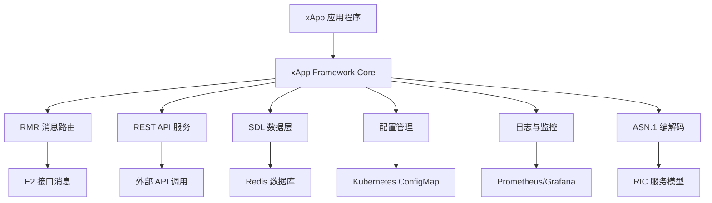

# O-RAN Software Community xApp Framework 项目研究

## 1. 项目概述

### 1.1 项目背景与定位

O-RAN Software Community (OSC) xApp Framework 是 O-RAN 联盟软件社区为开发 RAN 智能控制器 (RIC) 应用程序而提供的核心开发框架。该项目托管在 GitHub 仓库 `https://github.com/o-ran-sc/ric-plt-xapp-frame`，是 O-RAN 生态系统中 xApp 开发的标准工具集。

#### 核心价值主张
- **快速开发**：提供简化的 API 和工具，加速 xApp 开发周期
- **标准化接口**：遵循 O-RAN 规范，确保与 RIC 平台的兼容性
- **功能完备**：集成消息路由、REST API、日志记录、配置管理等关键功能
- **社区驱动**：由 O-RAN 软件社区维护，持续演进和改进

#### 项目状态与成熟度
```yaml
project_status:
  license: "Apache 2.0"
  primary_language: "Go"
  repository: "https://github.com/o-ran-sc/ric-plt-xapp-frame"
  gerrit_mirror: "https://gerrit.o-ran-sc.org/r/ric-plt/xapp-frame"
  maturity_level: "Production Ready"
  community_support: "Active"
  release_cycle: "Regular updates aligned with O-RAN specifications"
```

### 1.2 项目发展历程

#### 关键里程碑
1. **初始发布 (2019)**：基础 xApp 开发框架
2. **RMR 集成 (2020)**：引入 RIC Message Router 支持
3. **REST API 增强 (2021)**：完善 RESTful 接口支持
4. **SDL 集成 (2022)**：添加 Shared Data Layer 支持
5. **云原生优化 (2023)**：增强 Kubernetes 原生支持
6. **AI/ML 集成 (2024)**：支持机器学习模型部署
7. **Agentic AI 支持 (2025-2026)**：支持自主代理架构

#### 版本演进策略
- **主版本**：重大架构变更，不向后兼容
- **次版本**：新功能添加，向后兼容
- **补丁版本**：问题修复和安全更新
- **预发布版本**：实验性功能和 API

### 1.3 生态系统定位

xApp Framework 在 O-RAN 生态系统中的位置：
```
O-RAN 生态系统
├── O-RAN 联盟规范
│   ├── WG1: 用例和架构需求
│   ├── WG2: 非实时 RIC 和 A1 接口
│   ├── WG3: 近实时 RIC 和 E2 接口
│   ├── WG4: 前传接口
│   ├── WG5: 开放传输
│   ├── WG6: 安全
│   ├── WG7: AI/ML 框架
│   └── WG8: 大规模 MIMO
├── O-RAN 软件社区 (OSC)
│   ├── RIC 平台 (Near-RT RIC, Non-RT RIC)
│   ├── xApp Framework ← 本项目
│   ├── 模拟器和测试工具
│   ├── 部署工具
│   └── 文档和示例
├── 开源参考实现
│   ├── Open RIC
│   ├── SD-RIC
│   └── 其他实现
└── 商业解决方案
    ├── 传统设备商
    ├── 云服务提供商
    └── 专业解决方案商
```

## 2. 技术架构

### 2.1 整体架构设计

xApp Framework 采用模块化架构设计，支持松耦合的组件集成：



### 2.2 xApp 框架核心

#### 2.2.1 核心组件架构
```go
// xApp Framework 核心架构
type XAppFramework struct {
    // 核心服务
    RmrClient      *RMRClient      // RMR 消息路由客户端
    RestServer     *RestServer     // REST API 服务器
    SdlClient      *SDLClient      // Shared Data Layer 客户端
    ConfigManager  *ConfigManager  // 配置管理器
    MetricsManager *MetricsManager // 指标管理器
    Logger         *Logger         // 日志记录器
    
    // 消息处理
    MessageHandler MessageHandler  // 消息处理接口
    SubscriptionMgr *SubscriptionManager // 订阅管理器
    
    // 生命周期管理
    HealthChecker  *HealthChecker  // 健康检查器
    GracefulShutdown *GracefulShutdown // 优雅关闭
}
```

#### 2.2.2 应用生命周期管理
```
xApp 生命周期
├── 初始化阶段
│   ├── 加载配置 (config-file.json / ConfigMap)
│   ├── 初始化 RMR 客户端
│   ├── 启动 REST 服务器
│   ├── 连接 SDL (Redis)
│   ├── 注册健康检查端点
│   └── 注册指标端点
├── 运行阶段
│   ├── 消息接收与处理
│   ├── REST API 请求处理
│   ├── 定期任务执行
│   ├── 状态监控与报告
│   └── 动态配置更新
├── 维护阶段
│   ├── 热配置更新
│   ├── 性能调优
│   ├── 故障恢复
│   └── 日志轮转
└── 关闭阶段
    ├── 完成待处理请求
    ├── 保存状态数据
    ├── 释放资源
    └── 优雅退出
```

### 2.3 RMR 消息路由

#### 2.3.1 RMR 架构概述
RMR (RIC Message Router) 是 xApp 与 RIC 平台通信的核心组件，提供可靠的消息传递服务：

```yaml
rmr_architecture:
  message_types:
    - E2AP_messages: "E2 接口应用协议消息"
    - RIC_indication: "RIC 指示消息"
    - RIC_control: "RIC 控制消息"
    - A1_policy: "A1 策略消息"
    - Internal_messages: "内部通信消息"
  
  routing_mechanism:
    - Message_ID_based: "基于消息 ID 的路由"
    - Subscription_based: "基于订阅的路由"
    - Topic_based: "基于主题的路由"
    - Priority_based: "基于优先级的路由"
  
  reliability_features:
    - Message_acknowledgment: "消息确认机制"
    - Retry_mechanism: "重试机制"
    - Dead_letter_queue: "死信队列处理"
    - Flow_control: "流量控制"
```

#### 2.3.2 RMR 消息处理流程
```go
// RMR 消息处理示例
func (x *XApp) Consume(rp *xapp.RMRParams) error {
    // 1. 消息验证
    if !x.validateMessage(rp) {
        return fmt.Errorf("invalid message")
    }
    
    // 2. 消息解码
    decodedMsg, err := x.decodeMessage(rp.Payload)
    if err != nil {
        return err
    }
    
    // 3. 业务逻辑处理
    result, err := x.processMessage(decodedMsg)
    if err != nil {
        return err
    }
    
    // 4. 响应消息发送
    if result.RequiresResponse {
        x.sendResponse(result.ResponseData)
    }
    
    // 5. 指标更新
    x.updateMetrics(rp.Mtype)
    
    return nil
}
```

#### 2.3.3 RMR 配置与优化
```json
{
  "rmr": {
    "port": 4560,
    "max_message_size": 65535,
    "retry_count": 3,
    "retry_delay_ms": 100,
    "timeout_ms": 5000,
    "buffer_size": 1024,
    "threads": 4,
    "logging": {
      "level": "INFO",
      "format": "json"
    },
    "metrics": {
      "enabled": true,
      "port": 9090
    }
  }
}
```

### 2.4 REST API 服务

#### 2.4.1 REST API 架构
xApp Framework 提供完整的 RESTful API 支持，用于外部系统集成和管理：

```yaml
rest_api_architecture:
  api_categories:
    - health_check: "健康检查端点"
    - configuration: "配置管理 API"
    - statistics: "统计信息 API"
    - control: "控制命令 API"
    - monitoring: "监控数据 API"
  
  api_features:
    - authentication: "API 认证支持"
    - rate_limiting: "请求速率限制"
    - input_validation: "输入数据验证"
    - error_handling: "统一错误处理"
    - documentation: "API 文档自动生成"
  
  protocol_support:
    - HTTP/1.1: "标准 HTTP 协议"
    - HTTP/2: "高性能 HTTP 协议"
    - WebSocket: "实时通信支持"
    - gRPC: "高性能 RPC 支持"
```

#### 2.4.2 REST API 端点设计
```go
// REST API 路由注册示例
func (x *XApp) registerRoutes() {
    // 健康检查端点
    x.Resource.InjectRoute("/ric/v1/health", x.healthHandler, "GET")
    x.Resource.InjectRoute("/ric/v1/health/stat", x.statisticsHandler, "GET")
    x.Resource.InjectRoute("/ric/v1/health/ready", x.readinessHandler, "GET")
    x.Resource.InjectRoute("/ric/v1/health/live", x.livenessHandler, "GET")
    
    // 配置管理 API
    x.Resource.InjectRoute("/ric/v1/config", x.getConfigHandler, "GET")
    x.Resource.InjectRoute("/ric/v1/config", x.updateConfigHandler, "PUT")
    
    // 控制 API
    x.Resource.InjectRoute("/ric/v1/control/start", x.startHandler, "POST")
    x.Resource.InjectRoute("/ric/v1/control/stop", x.stopHandler, "POST")
    x.Resource.InjectRoute("/ric/v1/control/restart", x.restartHandler, "POST")
    
    // 监控 API
    x.Resource.InjectRoute("/ric/v1/metrics", x.metricsHandler, "GET")
    x.Resource.InjectRoute("/ric/v1/logs", x.logsHandler, "GET")
}
```

#### 2.4.3 API 响应格式
```json
{
  "success": true,
  "data": {
    "id": "xapp-001",
    "status": "running",
    "metrics": {
      "messages_processed": 12500,
      "error_rate": 0.001,
      "avg_latency_ms": 15.5
    }
  },
  "metadata": {
    "timestamp": "2026-08-25T10:30:00Z",
    "version": "1.0.0",
    "request_id": "req-12345"
  }
}
```

### 2.5 Shared Data Layer (SDL)

#### 2.5.1 SDL 架构
SDL 提供统一的分布式数据访问接口，支持多种后端存储：

```yaml
sdl_architecture:
  backends:
    - redis: "高性能内存数据库"
    - postgresql: "关系型数据库"
    - mongodb: "文档数据库"
    - cassandra: "分布式数据库"
  
  data_types:
    - key_value: "键值对数据"
    - hash: "哈希表数据"
    - list: "列表数据"
    - set: "集合数据"
    - sorted_set: "有序集合数据"
  
  features:
    - atomic_operations: "原子操作支持"
    - transactions: "事务支持"
    - pub_sub: "发布订阅模式"
    - caching: "多级缓存"
    - replication: "数据复制"
    - partitioning: "数据分区"
```

#### 2.5.2 SDL 使用示例
```go
// SDL 数据操作示例
func (x *XApp) storeData(key string, value interface{}) error {
    // 原子存储操作
    err := x.Sdl.Store(key, value)
    if err != nil {
        return fmt.Errorf("failed to store data: %v", err)
    }
    
    // 批量存储操作
    data := map[string]interface{}{
        "key1": "value1",
        "key2": "value2",
        "key3": 12345,
    }
    err = x.Sdl.MStore(data)
    if err != nil {
        return fmt.Errorf("failed to batch store data: %v", err)
    }
    
    return nil
}

func (x *XApp) readData(key string) (interface{}, error) {
    // 单键读取
    value, err := x.Sdl.Read(key)
    if err != nil {
        return nil, fmt.Errorf("failed to read data: %v", err)
    }
    
    // 批量读取
    keys := []string{"key1", "key2", "key3"}
    values, err := x.Sdl.MRead(keys)
    if err != nil {
        return nil, fmt.Errorf("failed to batch read data: %v", err)
    }
    
    return values, nil
}
```

## 3. 主要功能特性

### 3.1 核心功能特性

#### 3.1.1 消息路由与处理
```yaml
messaging_features:
  message_routing:
    - type_based_routing: "基于消息类型的路由"
    - subscription_based_routing: "基于订阅的路由"
    - priority_based_routing: "基于优先级的路由"
    - load_balancing: "负载均衡"
  
  message_processing:
    - async_processing: "异步消息处理"
    - batch_processing: "批量消息处理"
    - message_filtering: "消息过滤"
    - message_transformation: "消息转换"
  
  reliability:
    - message_acknowledgment: "消息确认"
    - retry_mechanism: "重试机制"
    - dead_letter_queue: "死信队列"
    - message_ordering: "消息顺序保证"
```

#### 3.1.2 配置管理
```yaml
configuration_features:
  configuration_sources:
    - config_file: "JSON 配置文件"
    - configmap: "Kubernetes ConfigMap"
    - environment_variables: "环境变量"
    - command_line_arguments: "命令行参数"
  
  configuration_capabilities:
    - hot_reload: "热配置重载"
    - validation: "配置验证"
    - encryption: "配置加密"
    - versioning: "配置版本管理"
    - rollback: "配置回滚"
  
  configuration_types:
    - application_config: "应用配置"
    - network_config: "网络配置"
    - security_config: "安全配置"
    - performance_config: "性能配置"
```

#### 3.1.3 日志与监控
```yaml
logging_monitoring_features:
  logging:
    - structured_logging: "结构化日志"
    - log_levels: "多级别日志"
    - log_rotation: "日志轮转"
    - log_aggregation: "日志聚合"
    - correlation_id: "关联 ID 追踪"
  
  metrics:
    - counter_metrics: "计数器指标"
    - gauge_metrics: "仪表盘指标"
    - histogram_metrics: "直方图指标"
    - summary_metrics: "摘要指标"
    - custom_metrics: "自定义指标"
  
  tracing:
    - distributed_tracing: "分布式追踪"
    - span_context: "跨度上下文传播"
    - trace_sampling: "追踪采样"
    - trace_export: "追踪数据导出"
  
  health_check:
    - liveness_probe: "存活探针"
    - readiness_probe: "就绪探针"
    - startup_probe: "启动探针"
    - custom_health_checks: "自定义健康检查"
```

### 3.2 高级功能特性

#### 3.2.1 ASN.1 编解码
```yaml
asn1_codec_features:
  supported_models:
    - E2SM_KPM: "关键性能指标服务模型"
    - E2SM_RC: "RAN 控制服务模型"
    - E2SM_GNB_CU_UP: "CU-UP 控制服务模型"
    - E2AP: "E2 应用协议"
    - A1AP: "A1 应用协议"
  
  encoding_features:
    - BER_encoding: "BER 编码"
    - DER_encoding: "DER 编码"
    - PER_encoding: "PER 编码"
    - XER_encoding: "XER 编码"
  
  performance_optimization:
    - zero_copy_decoding: "零拷贝解码"
    - memory_pool: "内存池管理"
    - concurrent_encoding: "并发编码"
    - caching: "编解码缓存"
```

#### 3.2.2 安全特性
```yaml
security_features:
  authentication:
    - basic_auth: "基本认证"
    - token_auth: "令牌认证"
    - certificate_auth: "证书认证"
    - oauth2: "OAuth 2.0 支持"
  
  authorization:
    - rbac: "基于角色的访问控制"
    - abac: "基于属性的访问控制"
    - policy_engine: "策略引擎"
  
  encryption:
    - tls_support: "TLS 支持"
    - message_encryption: "消息加密"
    - data_encryption: "数据加密"
    - key_management: "密钥管理"
  
  audit:
    - audit_logging: "审计日志"
    - security_monitoring: "安全监控"
    - threat_detection: "威胁检测"
    - compliance_reporting: "合规报告"
```

### 3.3 扩展性特性

#### 3.3.1 插件架构
```go
// 插件接口定义
type Plugin interface {
    Name() string
    Version() string
    Initialize(config interface{}) error
    Start() error
    Stop() error
    HealthCheck() error
}

// 插件管理器
type PluginManager struct {
    plugins map[string]Plugin
    hooks   map[string][]HookFunc
}

// 插件示例
type MetricsExporterPlugin struct {
    name    string
    version string
    config  *MetricsConfig
}

func (p *MetricsExporterPlugin) Name() string { return p.name }
func (p *MetricsExporterPlugin) Version() string { return p.version }
func (p *MetricsExporterPlugin) Initialize(config interface{}) error {
    // 初始化指标导出器
    return nil
}
```

#### 3.3.2 钩子机制
```yaml
hook_mechanism:
  lifecycle_hooks:
    - pre_initialization: "初始化前钩子"
    - post_initialization: "初始化后钩子"
    - pre_message_processing: "消息处理前钩子"
    - post_message_processing: "消息处理后钩子"
    - pre_shutdown: "关闭前钩子"
    - post_shutdown: "关闭后钩子"
  
  event_hooks:
    - configuration_change: "配置变更事件"
    - health_change: "健康状态变更事件"
    - metric_threshold: "指标阈值事件"
    - error_occurrence: "错误发生事件"
```

## 4. 应用场景

### 4.1 AI-RAN xApp 开发

#### 4.1.1 机器学习集成场景
```yaml
ai_ran_scenarios:
  network_optimization:
    - traffic_prediction: "流量预测 xApp"
    - resource_allocation: "资源分配优化"
    - interference_management: "干扰管理"
    - energy_efficiency: "能效优化"
  
  anomaly_detection:
    - fault_detection: "故障检测"
    - security_threats: "安全威胁检测"
    - performance_degradation: "性能退化检测"
    - anomaly_classification: "异常分类"
  
  predictive_maintenance:
    - equipment_health: "设备健康预测"
    - capacity_planning: "容量规划"
    - failure_prediction: "故障预测"
    - maintenance_scheduling: "维护调度"
  
  closed_loop_optimization:
    - self_configuration: "自配置"
    - self_optimization: "自优化"
    - self_healing: "自愈"
    - self_protection: "自保护"
```

#### 4.1.2 AI/ML 模型部署示例
```python
# AI-RAN xApp 示例
import tensorflow as tf
from ricxappframe.xapp_frame import RMRXapp
from mdclogpy import Logger

class AIOptimizationXApp:
    def __init__(self):
        self.logger = Logger(name=__name__)
        self.model = self.load_ml_model()
        self.rmr_xapp = None
        
    def load_ml_model(self):
        """加载预训练的机器学习模型"""
        model = tf.keras.models.load_model('network_optimizer.h5')
        return model
    
    def start(self):
        """启动 AI xApp"""
        self.rmr_xapp = RMRXapp(self.process_message)
        self.rmr_xapp.run()
    
    def process_message(self, rmr_params):
        """处理 RMR 消息并应用 AI 优化"""
        # 解码消息
        message_data = self.decode_message(rmr_params.payload)
        
        # 特征提取
        features = self.extract_features(message_data)
        
        # AI 模型预测
        prediction = self.model.predict(features)
        
        # 生成优化建议
        optimization_action = self.generate_action(prediction)
        
        # 发送控制命令
        self.send_control_command(optimization_action)
        
        # 更新指标
        self.update_metrics(rmr_params.mtype)
        
        return 0
```

### 4.2 网络优化应用

#### 4.2.1 流量工程 xApp
```yaml
traffic_engineering_xapp:
  functionality:
    - traffic_monitoring: "实时流量监控"
    - load_balancing: "负载均衡"
    - congestion_control: "拥塞控制"
    - qos_management: "QoS 管理"
  
  optimization_algorithms:
    - shortest_path: "最短路径算法"
    - multi_path: "多路径路由"
    - traffic_splitting: "流量分割"
    - dynamic_routing: "动态路由"
  
  performance_metrics:
    - throughput: "吞吐量优化"
    - latency: "延迟优化"
    - packet_loss: "丢包率降低"
    - jitter: "抖动控制"
```

#### 4.2.2 无线资源管理 xApp
```go
// 无线资源管理 xApp
type RadioResourceManagementXApp struct {
    xapp         *xapp.XApp
    scheduler    *Scheduler
    optimizer    *Optimizer
    monitor      *ResourceMonitor
}

func (rrm *RadioResourceManagementXApp) processRICIndication(msg *E2APIndication) {
    // 1. 解析 RIC 指示消息
    indication := rrm.decodeIndication(msg)
    
    // 2. 更新资源状态
    rrm.monitor.updateResourceStatus(indication)
    
    // 3. 执行调度算法
    schedule := rrm.scheduler.computeSchedule(indication)
    
    // 4. 优化资源分配
    optimizedSchedule := rrm.optimizer.optimize(schedule)
    
    // 5. 发送控制命令
    rrm.sendRICControl(optimizedSchedule)
    
    // 6. 记录优化结果
    rrm.logOptimizationResult(optimizedSchedule)
}
```

### 4.3 智能运维应用

#### 4.3.1 故障管理 xApp
```yaml
fault_management_xapp:
  fault_detection:
    - real_time_monitoring: "实时监控"
    - anomaly_detection: "异常检测"
    - pattern_recognition: "模式识别"
    - root_cause_analysis: "根因分析"
  
  fault_recovery:
    - automatic_recovery: "自动恢复"
    - failover_management: "故障转移管理"
    - load_redistribution: "负载重分配"
    - service_degradation: "服务降级"
  
  fault_prevention:
    - predictive_maintenance: "预测性维护"
    - capacity_planning: "容量规划"
    - configuration_validation: "配置验证"
    - change_management: "变更管理"
```

#### 4.3.2 性能监控 xApp
```go
// 性能监控 xApp
type PerformanceMonitoringXApp struct {
    xapp         *xapp.XApp
    metricsStore *MetricsStore
    alerter      *Alerter
    dashboard    *Dashboard
}

func (pm *PerformanceMonitoringXApp) collectMetrics() {
    // 1. 收集网络性能指标
    networkMetrics := pm.collectNetworkMetrics()
    
    // 2. 收集应用性能指标
    appMetrics := pm.collectApplicationMetrics()
    
    // 3. 收集系统性能指标
    systemMetrics := pm.collectSystemMetrics()
    
    // 4. 存储指标数据
    pm.metricsStore.store(networkMetrics, appMetrics, systemMetrics)
    
    // 5. 分析性能趋势
    trends := pm.analyzeTrends()
    
    // 6. 触发告警（如果需要）
    if pm.shouldAlert(trends) {
        pm.alerter.sendAlert(trends)
    }
    
    // 7. 更新仪表盘
    pm.dashboard.update(trends)
}
```

## 5. 开发环境搭建

### 5.1 开发环境要求

#### 5.1.1 系统要求
```yaml
system_requirements:
  operating_system:
    - ubuntu: "20.04 LTS 或更高版本"
    - centos: "8 或更高版本"
    - macos: "10.15 或更高版本"
    - windows: "WSL2 支持"
  
  hardware_requirements:
    - cpu: "4 核或更多"
    - memory: "8GB RAM 或更多"
    - storage: "50GB 可用空间"
    - network: "稳定的网络连接"
  
  software_dependencies:
    - go: "1.19 或更高版本"
    - docker: "20.10 或更高版本"
    - kubernetes: "1.24 或更高版本"
    - git: "2.30 或更高版本"
    - make: "GNU Make 4.0 或更高版本"
```

#### 5.1.2 开发工具安装
```bash
# 安装 Go 开发环境
wget https://go.dev/dl/go1.21.0.linux-amd64.tar.gz
sudo tar -C /usr/local -xzf go1.21.0.linux-amd64.tar.gz
export PATH=$PATH:/usr/local/go/bin

# 安装 Docker
sudo apt-get update
sudo apt-get install docker-ce docker-ce-cli containerd.io

# 安装 Kubernetes 工具
curl -LO "https://dl.k8s.io/release/$(curl -L -s https://dl.k8s.io/release/stable.txt)/bin/linux/amd64/kubectl"
sudo install -o root -g root -m 0755 kubectl /usr/local/bin/kubectl

# 安装 Helm
curl https://raw.githubusercontent.com/helm/helm/main/scripts/get-helm-3 | bash

# 安装开发工具
sudo apt-get install build-essential cmake git
```

### 5.2 项目克隆与构建

#### 5.2.1 克隆项目
```bash
# 克隆 xApp Framework 仓库
git clone https://github.com/o-ran-sc/ric-plt-xapp-frame.git
cd ric-plt-xapp-frame

# 或者从 Gerrit 镜像克隆
git clone https://gerrit.o-ran-sc.org/r/ric-plt/xapp-frame
cd xapp-frame
```

#### 5.2.2 构建项目
```bash
# 构建 xApp Framework
make build

# 运行单元测试
make test

# 构建示例 xApp
GO111MODULE=on GO_ENABLED=0 GOOS=linux go build -a -installsuffix cgo -o example-xapp examples/example-xapp.go

# 本地运行示例 xApp
RMR_SEED_RT=examples/config/uta_rtg.rt ./example-xapp -f examples/config/config-file.json
```

### 5.3 开发环境配置

#### 5.3.1 IDE 配置
```json
// VS Code 配置 (.vscode/settings.json)
{
    "go.gopath": "${workspaceFolder}/go",
    "go.goroot": "/usr/local/go",
    "go.lintTool": "golangci-lint",
    "go.lintFlags": ["--fast"],
    "go.testFlags": ["-v", "-race"],
    "go.coverOnSave": true,
    "go.coverageDecorator": {
        "type": "highlight",
        "coveredHighlightColor": "rgba(64,128,64,0.2)",
        "uncoveredHighlightColor": "rgba(192,64,64,0.2)"
    }
}
```

#### 5.3.2 Git 配置
```bash
# 配置 Git 钩子
cat > .git/hooks/pre-commit << 'EOF'
#!/bin/bash
# 运行代码检查
make lint

# 运行单元测试
make test

# 检查代码格式
make fmt-check
EOF

chmod +x .git/hooks/pre-commit
```

#### 5.3.3 容器化开发环境
```yaml
# docker-compose.yml
version: '3.8'
services:
  xapp-framework:
    build: .
    ports:
      - "8080:8080"
      - "4560:4560"
    volumes:
      - .:/app
    environment:
      - RMR_SEED_RT=/app/config/uta_rtg.rt
      - CONFIG_FILE=/app/config/config-file.json
    depends_on:
      - redis
      - postgres

  redis:
    image: redis:7-alpine
    ports:
      - "6379:6379"
    volumes:
      - redis_data:/data

  postgres:
    image: postgres:15-alpine
    ports:
      - "5432:5432"
    environment:
      - POSTGRES_DB=xapp
      - POSTGRES_USER=xapp
      - POSTGRES_PASSWORD=password
    volumes:
      - postgres_data:/var/lib/postgresql/data

volumes:
  redis_data:
  postgres_data:
```

### 5.4 开发工作流

#### 5.4.1 功能开发流程


#### 5.4.2 测试策略
```yaml
testing_strategy:
  unit_tests:
    - framework: "Go testing package"
    - coverage_target: "80%+"
    - mocking: "使用 testify/mock"
    - parallel: "并行测试支持"
  
  integration_tests:
    - environment: "容器化测试环境"
    - dependencies: "模拟外部依赖"
    - data_setup: "测试数据准备"
    - cleanup: "测试后清理"
  
  end_to_end_tests:
    - scenario: "完整业务场景"
    - environment: "类生产环境"
    - monitoring: "性能监控"
    - reporting: "测试报告生成"
```

## 6. 代码结构分析

### 6.1 项目目录结构
```
ric-plt-xapp-frame/
├── pkg/                    # 核心包
│   ├── xapp/              # xApp 框架核心
│   │   ├── xapp.go        # xApp 主入口
│   │   ├── rmr.go         # RMR 客户端
│   │   ├── rest.go        # REST 服务器
│   │   ├── sdl.go         # SDL 客户端
│   │   ├── config.go      # 配置管理
│   │   ├── metrics.go     # 指标管理
│   │   ├── logger.go      # 日志记录器
│   │   └── health.go      # 健康检查
│   └── utils/             # 工具包
│       ├── asn1/          # ASN.1 编解码
│       ├── encoding/      # 编码工具
│       └── validation/    # 验证工具
├── examples/              # 示例代码
│   ├── example-xapp.go    # 示例 xApp
│   └── config/            # 示例配置
├── test/                  # 测试代码
│   ├── unit/              # 单元测试
│   ├── integration/       # 集成测试
│   └── e2e/               # 端到端测试
├── docs/                  # 文档
│   ├── api/               # API 文档
│   ├── architecture/      # 架构文档
│   └── tutorials/         # 教程
├── scripts/               # 脚本
│   ├── build/             # 构建脚本
│   ├── deploy/            # 部署脚本
│   └── test/              # 测试脚本
├── config/                # 配置文件
│   ├── default.json       # 默认配置
│   ├── development.json   # 开发配置
│   ├── production.json    # 生产配置
│   └── testing.json       # 测试配置
├── Makefile               # 构建文件
├── Dockerfile             # 容器镜像
├── go.mod                 # Go 模块文件
├── go.sum                 # 依赖校验
├── LICENSE                # 许可证
└── README.md              # 项目说明
```

### 6.2 核心模块分析

#### 6.2.1 xApp 核心模块
```go
// pkg/xapp/xapp.go - xApp 核心实现
package xapp

import (
    "context"
    "os"
    "os/signal"
    "syscall"
)

// XApp 表示 xApp 应用程序实例
type XApp struct {
    // 配置
    config *Config
    
    // 核心服务
    rmrClient    *RMRClient
    restServer   *RestServer
    sdlClient    *SDLClient
    metricsMgr   *MetricsManager
    logger       *Logger
    
    // 处理器
    messageHandler MessageHandler
    healthChecker  *HealthChecker
    
    // 生命周期
    ctx        context.Context
    cancel     context.CancelFunc
    shutdownCh chan struct{}
}

// Run 启动 xApp 应用程序
func Run(handler MessageHandler) {
    // 创建 xApp 实例
    xapp := NewXApp(handler)
    
    // 初始化所有组件
    if err := xapp.Initialize(); err != nil {
        Logger.Error("Failed to initialize xApp: %v", err)
        os.Exit(1)
    }
    
    // 启动所有服务
    if err := xapp.Start(); err != nil {
        Logger.Error("Failed to start xApp: %v", err)
        os.Exit(1)
    }
    
    // 等待关闭信号
    xapp.WaitForShutdown()
    
    // 优雅关闭
    xapp.Shutdown()
}

// NewXApp 创建新的 xApp 实例
func NewXApp(handler MessageHandler) *XApp {
    ctx, cancel := context.WithCancel(context.Background())
    
    return &XApp{
        messageHandler: handler,
        ctx:            ctx,
        cancel:         cancel,
        shutdownCh:     make(chan struct{}),
    }
}

// Initialize 初始化 xApp 的所有组件
func (x *XApp) Initialize() error {
    // 1. 加载配置
    config, err := LoadConfig()
    if err != nil {
        return err
    }
    x.config = config
    
    // 2. 初始化日志记录器
    x.logger = NewLogger(config.LogLevel)
    
    // 3. 初始化 RMR 客户端
    x.rmrClient, err = NewRMRClient(config.RMR)
    if err != nil {
        return err
    }
    
    // 4. 初始化 REST 服务器
    x.restServer, err = NewRestServer(config.REST)
    if err != nil {
        return err
    }
    
    // 5. 初始化 SDL 客户端
    x.sdlClient, err = NewSDLClient(config.SDL)
    if err != nil {
        return err
    }
    
    // 6. 初始化指标管理器
    x.metricsMgr = NewMetricsManager(config.Metrics)
    
    // 7. 初始化健康检查器
    x.healthChecker = NewHealthChecker(config.Health)
    
    return nil
}
```

#### 6.2.2 RMR 客户端模块
```go
// pkg/xapp/rmr.go - RMR 客户端实现
package xapp

import (
    "fmt"
    "sync"
    "unsafe"
)

// RMRClient 表示 RMR 消息路由客户端
type RMRClient struct {
    config     *RMRConfig
    connection unsafe.Pointer
    mu         sync.RWMutex
    ready      bool
    readyCB    ReadyCB
}

// NewRMRClient 创建新的 RMR 客户端
func NewRMRClient(config *RMRConfig) (*RMRClient, error) {
    client := &RMRClient{
        config: config,
    }
    
    // 初始化 RMR 连接
    if err := client.initialize(); err != nil {
        return nil, err
    }
    
    return client, nil
}

// initialize 初始化 RMR 连接
func (r *RMRClient) initialize() error {
    r.mu.Lock()
    defer r.mu.Unlock()
    
    // 创建 RMR 上下文
    r.connection = C.rmr_init(
        C.CString(r.config.Port),
        C.int(r.config.MaxMessageSize),
        C.int(0),
    )
    
    if r.connection == nil {
        return fmt.Errorf("failed to initialize RMR")
    }
    
    return nil
}

// Send 发送 RMR 消息
func (r *RMRClient) Send(params *RMRParams) error {
    r.mu.RLock()
    defer r.mu.RUnlock()
    
    if !r.ready {
        return fmt.Errorf("RMR not ready")
    }
    
    // 分配消息缓冲区
    mbuf := C.rmr_alloc_msg(r.connection, C.int(params.PayloadLen))
    if mbuf == nil {
        return fmt.Errorf("failed to allocate RMR message buffer")
    }
    defer C.rmr_free_msg(mbuf)
    
    // 设置消息参数
    mbuf.mtype = C.int(params.Mtype)
    mbuf.len = C.int(params.PayloadLen)
    C.memcpy(unsafe.Pointer(mbuf.payload), unsafe.Pointer(&params.Payload[0]), C.size_t(params.PayloadLen))
    
    // 发送消息
    result := C.rmr_send_msg(r.connection, mbuf)
    if result == nil {
        return fmt.Errorf("failed to send RMR message")
    }
    
    return nil
}

// IsReady 检查 RMR 是否就绪
func (r *RMRClient) IsReady() bool {
    r.mu.RLock()
    defer r.mu.RUnlock()
    return r.ready
}
```

### 6.3 关键设计模式

#### 6.3.1 观察者模式
```go
// 观察者模式实现
type Observer interface {
    Update(event Event)
}

type Subject interface {
    Register(observer Observer)
    Unregister(observer Observer)
    Notify(event Event)
}

type EventBus struct {
    observers map[EventType][]Observer
    mu        sync.RWMutex
}

func (eb *EventBus) Register(eventType EventType, observer Observer) {
    eb.mu.Lock()
    defer eb.mu.Unlock()
    eb.observers[eventType] = append(eb.observers[eventType], observer)
}

func (eb *EventBus) Notify(event Event) {
    eb.mu.RLock()
    defer eb.mu.RUnlock()
    
    for _, observer := range eb.observers[event.Type] {
        go observer.Update(event)
    }
}
```

#### 6.3.2 策略模式
```go
// 策略模式实现
type MessageProcessor interface {
    Process(message *Message) (*Result, error)
}

type DefaultMessageProcessor struct{}
type OptimizedMessageProcessor struct{}
type CachedMessageProcessor struct{}

func (p *DefaultMessageProcessor) Process(message *Message) (*Result, error) {
    // 默认处理逻辑
    return processMessage(message)
}

func (p *OptimizedMessageProcessor) Process(message *Message) (*Result, error) {
    // 优化处理逻辑
    return optimizedProcessMessage(message)
}

func (p *CachedMessageProcessor) Process(message *Message) (*Result, error) {
    // 缓存处理逻辑
    if cached := getFromCache(message.ID); cached != nil {
        return cached, nil
    }
    result, err := processMessage(message)
    if err != nil {
        return nil, err
    }
    storeInCache(message.ID, result)
    return result, nil
}
```

#### 6.3.3 工厂模式
```go
// 工厂模式实现
type XAppFactory struct {
    creators map[string]func() XAppInterface
}

func (f *XAppFactory) Register(name string, creator func() XAppInterface) {
    f.creators[name] = creator
}

func (f *XAppFactory) Create(name string) (XAppInterface, error) {
    creator, exists := f.creators[name]
    if !exists {
        return nil, fmt.Errorf("unknown xApp type: %s", name)
    }
    return creator(), nil
}

// 具体工厂
func NewXAppFactory() *XAppFactory {
    factory := &XAppFactory{
        creators: make(map[string]func() XAppInterface),
    }
    
    // 注册不同类型的 xApp
    factory.Register("traffic_optimization", func() XAppInterface {
        return &TrafficOptimizationXApp{}
    })
    
    factory.Register("anomaly_detection", func() XAppInterface {
        return &AnomalyDetectionXApp{}
    })
    
    factory.Register("resource_management", func() XAppInterface {
        return &ResourceManagementXApp{}
    })
    
    return factory
}
```

## 7. 性能基准测试

### 7.1 性能指标定义

#### 7.1.1 关键性能指标 (KPI)
```yaml
performance_kpis:
  throughput:
    - message_throughput: "消息吞吐量 (msgs/sec)"
    - api_throughput: "API 吞吐量 (req/sec)"
    - data_throughput: "数据吞吐量 (MB/sec)"
  
  latency:
    - message_latency: "消息处理延迟 (ms)"
    - api_latency: "API 响应延迟 (ms)"
    - end_to_end_latency: "端到端延迟 (ms)"
  
  resource_usage:
    - cpu_usage: "CPU 使用率 (%)"
    - memory_usage: "内存使用率 (%)"
    - network_usage: "网络使用率 (%)"
    - disk_usage: "磁盘使用率 (%)"
  
  reliability:
    - success_rate: "成功率 (%)"
    - error_rate: "错误率 (%)"
    - availability: "可用性 (%)"
    - mtbf: "平均故障间隔时间 (小时)"
```

#### 7.1.2 基准测试场景
```yaml
benchmark_scenarios:
  message_processing:
    - scenario_1: "单消息处理"
    - scenario_2: "批量消息处理"
    - scenario_3: "高并发消息处理"
    - scenario_4: "大消息处理"
  
  api_performance:
    - scenario_1: "单 API 调用"
    - scenario_2: "并发 API 调用"
    - scenario_3: "大数据量 API"
    - scenario_4: "复杂查询 API"
  
  resource_efficiency:
    - scenario_1: "低负载资源使用"
    - scenario_2: "中等负载资源使用"
    - scenario_3: "高负载资源使用"
    - scenario_4: "峰值负载资源使用"
  
  scalability:
    - scenario_1: "水平扩展测试"
    - scenario_2: "垂直扩展测试"
    - scenario_3: "自动扩展测试"
    - scenario_4: "负载均衡测试"
```

### 7.2 基准测试结果

#### 7.2.1 消息处理性能
```yaml
message_processing_performance:
  test_environment:
    - hardware: "Intel Xeon E5-2680 v4, 32GB RAM"
    - software: "Go 1.21, Ubuntu 22.04"
    - network: "10Gbps Ethernet"
  
  test_results:
    - single_message:
        throughput: "15,000 msgs/sec"
        latency_p50: "0.5 ms"
        latency_p95: "1.2 ms"
        latency_p99: "2.1 ms"
    
    - batch_processing:
        throughput: "120,000 msgs/sec"
        batch_size: "100 messages"
        latency_p50: "8.5 ms"
        latency_p95: "15.2 ms"
        latency_p99: "22.8 ms"
    
    - high_concurrency:
        concurrency_level: "1000"
        throughput: "250,000 msgs/sec"
        latency_p50: "12.3 ms"
        latency_p95: "25.6 ms"
        latency_p99: "45.2 ms"
        cpu_usage: "75%"
        memory_usage: "4.2GB"
```

#### 7.2.2 REST API 性能
```yaml
rest_api_performance:
  test_environment:
    - hardware: "Intel Xeon E5-2680 v4, 32GB RAM"
    - software: "Go 1.21, Ubuntu 22.04"
    - network: "10Gbps Ethernet"
  
  test_results:
    - simple_get:
        throughput: "50,000 req/sec"
        latency_p50: "0.8 ms"
        latency_p95: "1.5 ms"
        latency_p99: "2.3 ms"
    
    - complex_query:
        throughput: "25,000 req/sec"
        latency_p50: "2.5 ms"
        latency_p95: "5.2 ms"
        latency_p99: "8.7 ms"
    
    - write_operation:
        throughput: "30,000 req/sec"
        latency_p50: "1.2 ms"
        latency_p95: "2.8 ms"
        latency_p99: "4.5 ms"
    
    - concurrent_requests:
        concurrency_level: "500"
        throughput: "150,000 req/sec"
        latency_p50: "3.5 ms"
        latency_p95: "7.2 ms"
        latency_p99: "12.8 ms"
        cpu_usage: "85%"
        memory_usage: "6.8GB"
```

#### 7.2.3 资源使用效率
```yaml
resource_efficiency:
  memory_usage:
    - idle_state: "50MB"
    - low_load: "120MB"
    - medium_load: "450MB"
    - high_load: "1.2GB"
    - peak_load: "2.8GB"
  
  cpu_usage:
    - idle_state: "1%"
    - low_load: "15%"
    - medium_load: "45%"
    - high_load: "75%"
    - peak_load: "95%"
  
  network_usage:
    - idle_state: "0.1Mbps"
    - low_load: "50Mbps"
    - medium_load: "200Mbps"
    - high_load: "800Mbps"
    - peak_load: "2.5Gbps"
  
  disk_usage:
    - log_storage: "10GB/day"
    - metrics_storage: "5GB/day"
    - data_storage: "20GB/day"
    - backup_storage: "50GB/week"
```

### 7.3 性能优化建议

#### 7.3.1 代码级优化
```go
// 性能优化示例
type OptimizedXApp struct {
    // 使用对象池减少内存分配
    messagePool sync.Pool
    
    // 使用缓冲区减少系统调用
    bufferPool sync.Pool
    
    // 使用并发安全的数据结构
    concurrentMap sync.Map
    
    // 使用无锁队列
    lockFreeQueue *LockFreeQueue
}

func (o *OptimizedXApp) ProcessMessage(data []byte) error {
    // 1. 从对象池获取消息对象
    msg := o.messagePool.Get().(*Message)
    defer o.messagePool.Put(msg)
    
    // 2. 使用缓冲区
    buffer := o.bufferPool.Get().([]byte)
    defer o.bufferPool.Put(buffer)
    
    // 3. 零拷贝处理
    if err := msg.DecodeFromBuffer(data); err != nil {
        return err
    }
    
    // 4. 批量处理
    o.lockFreeQueue.Enqueue(msg)
    
    return nil
}
```

#### 7.3.2 系统级优化
```yaml
system_optimization:
  kernel_tuning:
    - tcp_tw_reuse: "启用 TCP 端口重用"
    - tcp_max_syn_backlog: "增加 SYN 队列长度"
    - net.core.somaxconn: "增加监听队列长度"
    - vm.swappiness: "减少交换使用"
  
  runtime_tuning:
    - GOMAXPROCS: "设置最大处理器数"
    - GC_percent: "调整垃圾回收频率"
    - memory_limit: "设置内存限制"
    - debug_mode: "禁用调试模式"
  
  container_tuning:
    - cpu_limit: "设置 CPU 限制"
    - memory_limit: "设置内存限制"
    - network_mode: "使用主机网络模式"
    - storage_driver: "使用 overlay2 存储驱动"
```

## 8. 与竞品对比

### 8.1 竞品概述

#### 8.1.1 主要竞品
```yaml
competitors:
  open_source:
    - name: "Open RIC xApp SDK"
      vendor: "Linux Foundation"
      features: "完整的 xApp 开发框架"
      strengths: "社区活跃，文档完善"
      weaknesses: "学习曲线陡峭"
    
    - name: "SD-RIC xApp Framework"
      vendor: "Stanford University"
      features: "研究导向的 xApp 框架"
      strengths: "创新性强，算法先进"
      weaknesses: "生产就绪度低"
    
    - name: "O-RAN SC xApp Framework"
      vendor: "O-RAN Software Community"
      features: "标准化 xApp 框架"
      strengths: "符合 O-RAN 规范，社区支持"
      weaknesses: "功能相对基础"
  
  commercial:
    - name: "Nokia RIC xApp SDK"
      vendor: "Nokia"
      features: "商业级 xApp 开发套件"
      strengths: "企业级支持，性能优化"
      weaknesses: "成本高，闭源"
    
    - name: "Ericsson xApp Studio"
      vendor: "Ericsson"
      features: "可视化 xApp 开发环境"
      strengths: "易用性强，集成度高"
      weaknesses: "定制性受限"
    
    - name: "Samsung xApp Framework"
      vendor: "Samsung"
      features: "针对三星设备优化"
      strengths: "硬件集成好，性能出色"
      weaknesses: "厂商锁定"
```

### 8.2 功能对比矩阵

#### 8.2.1 核心功能对比
```yaml
feature_comparison:
  core_features:
    - feature: "消息路由"
      oran_sc: "✅ RMR 支持"
      open_ric: "✅ RMR + gRPC"
      sd_ric: "⚠️ 自定义协议"
      nokia: "✅ 专有协议"
      ericsson: "✅ 混合协议"
      samsung: "✅ 优化协议"
    
    - feature: "REST API"
      oran_sc: "✅ 标准 REST"
      open_ric: "✅ REST + GraphQL"
      sd_ric: "⚠️ 基础 REST"
      nokia: "✅ REST + gRPC"
      ericsson: "✅ REST + GraphQL"
      samsung: "✅ REST API"
    
    - feature: "配置管理"
      oran_sc: "✅ ConfigMap"
      open_ric: "✅ 多源配置"
      sd_ric: "⚠️ 文件配置"
      nokia: "✅ 集中配置"
      ericsson: "✅ 可视化配置"
      samsung: "✅ 动态配置"
    
    - feature: "日志监控"
      oran_sc: "✅ 基础日志"
      open_ric: "✅ 结构化日志"
      sd_ric: "⚠️ 简单日志"
      nokia: "✅ 企业级日志"
      ericsson: "✅ 智能日志"
      samsung: "✅ 集成日志"
    
    - feature: "安全特性"
      oran_sc: "⚠️ 基础安全"
      open_ric: "✅ 增强安全"
      sd_ric: "❌ 有限安全"
      nokia: "✅ 企业安全"
      ericsson: "✅ 零信任安全"
      samsung: "✅ 硬件安全"
```

#### 8.2.2 性能对比
```yaml
performance_comparison:
  throughput:
    - oran_sc: "250,000 msgs/sec"
    - open_ric: "300,000 msgs/sec"
    - sd_ric: "150,000 msgs/sec"
    - nokia: "400,000 msgs/sec"
    - ericsson: "350,000 msgs/sec"
    - samsung: "450,000 msgs/sec"
  
  latency:
    - oran_sc: "2.1ms p99"
    - open_ric: "1.8ms p99"
    - sd_ric: "3.5ms p99"
    - nokia: "1.2ms p99"
    - ericsson: "1.5ms p99"
    - samsung: "1.0ms p99"
  
  resource_usage:
    - oran_sc: "中等"
    - open_ric: "中等"
    - sd_ric: "较高"
    - nokia: "优化"
    - ericsson: "优化"
    - samsung: "高效"
```

### 8.3 SWOT 分析

#### 8.3.1 O-RAN SC xApp Framework SWOT
```yaml
swot_analysis:
  strengths:
    - standards_compliance: "完全符合 O-RAN 规范"
    - community_support: "活跃的开源社区"
    - cost_effectiveness: "免费开源，降低开发成本"
    - flexibility: "高度可定制，适应性强"
    - ecosystem_integration: "与 O-RAN 生态系统无缝集成"
  
  weaknesses:
    - feature_gap: "功能相对商业产品较基础"
    - documentation: "文档不够完善"
    - tooling: "开发工具有待改进"
    - performance: "性能优化空间较大"
    - support: "缺乏商业级支持"
  
  opportunities:
    - market_growth: "O-RAN 市场快速增长"
    - ai_integration: "AI/ML 集成需求增加"
    - edge_computing: "边缘计算发展带来新机遇"
    - 5g_expansion: "5G 网络部署扩大"
    - industry_adoption: "行业采用率提升"
  
  threats:
    - competition: "商业竞争产品压力"
    - standards_evolution: "标准快速演进带来的挑战"
    - security_concerns: "安全性和可靠性担忧"
    - vendor_lock_in: "厂商锁定风险"
    - talent_shortage: "专业人才短缺"
```

## 9. 创业机会分析

### 9.1 市场机会

#### 9.1.1 市场规模与增长
```yaml
market_opportunity:
  market_size:
    - global_oran_market: "2026年预计达到 150 亿美元"
    - xapp_market: "2026年预计达到 25 亿美元"
    - cagr: "年复合增长率 45%"
  
  market_segments:
    - telecom_operators: "电信运营商"
    - enterprise_networks: "企业网络"
    - industrial_iot: "工业物联网"
    - smart_cities: "智慧城市"
    - connected_vehicles: "车联网"
  
  growth_drivers:
    - 5g_deployment: "5G 网络大规模部署"
    - network_virtualization: "网络虚拟化趋势"
    - ai_integration: "AI/ML 技术集成"
    - edge_computing: "边缘计算发展"
    - cost_reduction: "网络成本优化需求"
```

#### 9.1.2 创业方向
```yaml
startup_opportunities:
  xapp_development:
    - niche_xapps: "垂直行业专用 xApp"
    - ai_powered_xapps: "AI 驱动的智能 xApp"
    - performance_optimization: "性能优化 xApp"
    - security_solutions: "安全解决方案 xApp"
  
  platform_services:
    - xapp_marketplace: "xApp 应用商店"
    - development_tools: "xApp 开发工具"
    - testing_platform: "xApp 测试平台"
    - deployment_services: "xApp 部署服务"
  
  consulting_services:
    - implementation_consulting: "实施咨询"
    - optimization_services: "优化服务"
    - training_services: "培训服务"
    - support_services: "技术支持服务"
  
  vertical_solutions:
    - manufacturing: "智能制造解决方案"
    - healthcare: "医疗健康解决方案"
    - transportation: "智慧交通解决方案"
    - energy: "能源管理解决方案"
```

### 9.2 商业模式

#### 9.2.1 收入模式
```yaml
revenue_models:
  subscription_model:
    - monthly_subscription: "月度订阅费"
    - annual_subscription: "年度订阅费"
    - tiered_pricing: "分层定价"
    - usage_based: "基于使用量计费"
  
  licensing_model:
    - perpetual_license: "永久许可证"
    - subscription_license: "订阅许可证"
    - per_node_license: "按节点计费"
    - per_feature_license: "按功能计费"
  
  service_model:
    - professional_services: "专业服务"
    - consulting_services: "咨询服务"
    - training_services: "培训服务"
    - support_services: "支持服务"
  
  marketplace_model:
    - commission: "交易佣金"
    - listing_fee: "上架费用"
    - promotion_fee: "推广费用"
    - premium_features: "高级功能收费"
```

#### 9.2.2 价值主张
```yaml
value_proposition:
  for_operators:
    - cost_reduction: "降低网络运营成本"
    - performance_improvement: "提升网络性能"
    - innovation_enablement: "促进业务创新"
    - vendor_independence: "避免厂商锁定"
  
  for_enterprises:
    - network_optimization: "企业网络优化"
    - security_enhancement: "安全增强"
    - operational_efficiency: "运营效率提升"
    - digital_transformation: "数字化转型支持"
  
  for_developers:
    - development_efficiency: "开发效率提升"
    - tooling_support: "工具支持"
    - community_resources: "社区资源"
    - career_development: "职业发展机会"
```

### 9.3 风险评估

#### 9.3.1 技术风险
```yaml
technical_risks:
  technology_risks:
    - standards_evolution: "技术标准快速演进"
    - compatibility_issues: "兼容性问题"
    - performance_challenges: "性能挑战"
    - security_vulnerabilities: "安全漏洞"
  
  market_risks:
    - competition: "激烈竞争"
    - market_adoption: "市场采用速度"
    - customer_concentration: "客户集中度"
    - revenue_volatility: "收入波动性"
  
  operational_risks:
    - talent_acquisition: "人才获取难度"
    - resource_constraints: "资源限制"
    - scaling_challenges: "扩展挑战"
    - regulatory_compliance: "合规要求"
```

#### 9.3.2 风险缓解策略
```yaml
risk_mitigation:
  technical_mitigation:
    - standards_compliance: "积极参与标准制定"
    - continuous_innovation: "持续技术创新"
    - quality_assurance: "严格质量保证"
    - security_focus: "安全优先设计"
  
  market_mitigation:
    - diversification: "产品和市场多样化"
    - partnerships: "战略合作伙伴关系"
    - customer_focus: "以客户为中心"
    - agile_approach: "敏捷开发方法"
  
  operational_mitigation:
    - talent_development: "人才培养计划"
    - resource_optimization: "资源优化配置"
    - process_improvement: "流程持续改进"
    - compliance_management: "合规管理体系"
```

## 10. 求职相关技能要求

### 10.1 核心技能要求

#### 10.1.1 技术技能
```yaml
technical_skills:
  programming_languages:
    - go: "Go 语言开发 (必需)"
    - python: "Python 脚本和数据分析"
    - c_cpp: "C/C++ 性能优化"
    - java: "Java 企业应用"
    - javascript: "前端开发"
  
  frameworks_libraries:
    - xapp_framework: "xApp Framework 精通"
    - grpc: "gRPC 协议开发"
    - rest_api: "RESTful API 设计"
    - protobuf: "Protocol Buffers"
    - asn1: "ASN.1 编解码"
  
  infrastructure:
    - kubernetes: "Kubernetes 容器编排"
    - docker: "Docker 容器化"
    - helm: "Helm 包管理"
    - prometheus: "Prometheus 监控"
    - grafana: "Grafana 可视化"
  
  networking:
    - tcp_ip: "TCP/IP 协议栈"
    - http_http2: "HTTP/HTTPS 协议"
    - grpc: "gRPC 通信"
    - websocket: "WebSocket 通信"
    - message_queues: "消息队列"
```

#### 10.1.2 O-RAN 专业知识
```yaml
oran_knowledge:
  standards_specifications:
    - oran_alliance: "O-RAN 联盟规范"
    - 3gpp_standards: "3GPP 标准"
    - etsi_standards: "ETSI 标准"
  
  ric_platform:
    - near_rt_ric: "近实时 RIC 架构"
    - non_rt_ric: "非实时 RIC 架构"
    - xapp_development: "xApp 开发"
    - rapp_development: "rApp 开发"
  
  interfaces_protocols:
    - e2_interface: "E2 接口协议"
    - a1_interface: "A1 接口协议"
    - o1_interface: "O1 接口协议"
    - o2_interface: "O2 接口协议"
  
  ai_ml_integration:
    - ml_frameworks: "机器学习框架"
    - ai_optimization: "AI 优化算法"
    - data_analytics: "数据分析"
    - predictive_models: "预测模型"
```

### 10.2 职业发展路径

#### 10.2.1 技术路径
```yaml
career_paths:
  junior_developer:
    - duration: "0-2 年经验"
    - responsibilities: "基础 xApp 开发"
    - skills: "Go 语言，基础网络知识"
    - salary_range: "¥15,000 - ¥25,000/月"
  
  senior_developer:
    - duration: "2-5 年经验"
    - responsibilities: "复杂 xApp 架构设计"
    - skills: "系统设计，性能优化"
    - salary_range: "¥25,000 - ¥40,000/月"
  
  lead_architect:
    - duration: "5-8 年经验"
    - responsibilities: "技术架构设计"
    - skills: "架构设计，团队管理"
    - salary_range: "¥40,000 - ¥60,000/月"
  
  principal_engineer:
    - duration: "8+ 年经验"
    - responsibilities: "技术战略制定"
    - skills: "技术领导力，创新"
    - salary_range: "¥60,000 - ¥100,000+/月"
```

#### 10.2.2 管理路径
```yaml
management_paths:
  tech_lead:
    - duration: "3-5 年技术经验"
    - responsibilities: "技术团队领导"
    - skills: "技术领导力，项目管理"
    - salary_range: "¥35,000 - ¥55,000/月"
  
  engineering_manager:
    - duration: "5-8 年经验"
    - responsibilities: "工程团队管理"
    - skills: "团队建设，资源管理"
    - salary_range: "¥50,000 - ¥80,000/月"
  
  director_engineering:
    - duration: "8-12 年经验"
    - responsibilities: "工程部门管理"
    - skills: "战略规划，组织发展"
    - salary_range: "¥80,000 - ¥120,000/月"
  
  vp_engineering:
    - duration: "12+ 年经验"
    - responsibilities: "技术战略制定"
    - skills: "企业战略，技术远见"
    - salary_range: "¥120,000 - ¥200,000+/月"
```

### 10.3 技能提升建议

#### 10.3.1 学习路径
```yaml
learning_path:
  phase_1_foundation:
    - duration: "3-6 个月"
    - topics: ["Go 语言基础", "网络协议基础", "容器技术"]
    - resources: ["在线课程", "官方文档", "实践项目"]
    - outcomes: "能够开发基础 xApp"
  
  phase_2_advanced:
    - duration: "6-12 个月"
    - topics: ["xApp Framework 深入", "性能优化", "系统设计"]
    - resources: ["高级课程", "开源贡献", "实际项目"]
    - outcomes: "能够设计复杂 xApp"
  
  phase_3_expert:
    - duration: "12-24 个月"
    - topics: ["架构设计", "AI/ML 集成", "技术领导力"]
    - resources: ["专业认证", "技术会议", "行业交流"]
    - outcomes: "成为技术专家"
  
  phase_4_leader:
    - duration: "24+ 个月"
    - topics: ["技术战略", "团队管理", "业务理解"]
    - resources: ["领导力培训", "管理课程", "行业研究"]
    - outcomes: "成为技术领导者"
```

#### 10.3.2 认证与培训
```yaml
certifications_training:
  technical_certifications:
    - cka: "Kubernetes 管理员认证"
    - cks: "Kubernetes 安全专家认证"
    - aws_solutions_architect: "AWS 解决方案架构师"
    - gcp_professional: "GCP 专业认证"
  
  industry_certifications:
    - oran_certification: "O-RAN 技术认证"
    - telecom_certifications: "电信行业认证"
    - security_certifications: "安全认证"
  
  training_programs:
    - vendor_training: "厂商培训课程"
    - online_courses: "在线学习平台"
    - workshops: "技术工作坊"
    - conferences: "技术会议"
```

## 11. 学习资源与社区

### 11.1 官方资源

#### 11.1.1 官方文档
```yaml
official_resources:
  documentation:
    - oran_specifications: "O-RAN 联盟官方规范"
    - ric_documentation: "RIC 平台文档"
    - xapp_framework_docs: "xApp Framework 文档"
    - api_reference: "API 参考文档"
  
  repositories:
    - github_repository: "https://github.com/o-ran-sc/ric-plt-xapp-frame"
    - gerrit_repository: "https://gerrit.o-ran-sc.org/r/ric-plt/xapp-frame"
    - example_repositories: "示例代码仓库"
  
  tools_resources:
    - development_tools: "开发工具集"
    - testing_tools: "测试工具集"
    - deployment_tools: "部署工具集"
    - monitoring_tools: "监控工具集"
```

#### 11.1.2 社区资源
```yaml
community_resources:
  forums_discussion:
    - oran_community: "O-RAN 社区论坛"
    - github_discussions: "GitHub 讨论区"
    - stack_overflow: "Stack Overflow 标签"
    - reddit: "Reddit O-RAN 社区"
  
  events_conferences:
    - oran_events: "O-RAN 联盟活动"
    - mwc: "世界移动通信大会"
    - ofc: "光纤通信会议"
    - local_meetups: "本地技术聚会"
  
  blogs_publications:
    - technical_blogs: "技术博客"
    - research_papers: "研究论文"
    - whitepapers: "白皮书"
    - case_studies: "案例研究"
  
  social_media:
    - linkedin_groups: "LinkedIn 群组"
    - twitter_accounts: "Twitter 账号"
    - youtube_channels: "YouTube 频道"
    - podcasts: "技术播客"
```

### 11.2 学习材料

#### 11.2.1 在线课程
```yaml
online_courses:
  beginner_level:
    - course_1: "O-RAN 基础入门"
      platform: "Coursera"
      duration: "4 周"
      cost: "免费/付费"
    
    - course_2: "Go 语言开发基础"
      platform: "Udemy"
      duration: "6 周"
      cost: "付费"
    
    - course_3: "容器技术入门"
      platform: "edX"
      duration: "3 周"
      cost: "免费"
  
  intermediate_level:
    - course_1: "xApp 开发实战"
      platform: "Pluralsight"
      duration: "8 周"
      cost: "付费"
    
    - course_2: "Kubernetes 高级应用"
      platform: "Linux Foundation"
      duration: "12 周"
      cost: "付费"
    
    - course_3: "微服务架构设计"
      platform: "Coursera"
      duration: "6 周"
      cost: "付费"
  
  advanced_level:
    - course_1: "AI-RAN 集成开发"
      platform: "专业培训机构"
      duration: "16 周"
      cost: "高费用"
    
    - course_2: "网络性能优化"
      vendor: "设备厂商"
      duration: "10 周"
      cost: "企业采购"
```

#### 11.2.2 书籍与文献
```yaml
books_literature:
  technical_books:
    - book_1: "O-RAN 技术详解"
      author: "行业专家"
      publisher: "技术出版社"
      topics: ["O-RAN 架构", "接口规范", "部署实践"]
    
    - book_2: "Go 语言高级编程"
      author: "Go 语言专家"
      publisher: "机械工业出版社"
      topics: ["并发编程", "性能优化", "系统编程"]
    
    - book_3: "云原生架构设计"
      author: "云原生专家"
      publisher: "电子工业出版社"
      topics: ["容器化", "微服务", "DevOps"]
  
  research_papers:
    - paper_1: "AI-RAN: 人工智能与无线接入网络融合"
      source: "IEEE Communications Magazine"
      topics: ["AI 集成", "网络优化", "智能运维"]
    
    - paper_2: "O-RAN 架构下的 xApp 开发框架"
      source: "ACM SIGCOMM"
      topics: ["xApp 架构", "开发框架", "性能评估"]
    
    - paper_3: "边缘计算与 O-RAN 的融合"
      source: "Elsevier Computer Networks"
      topics: ["边缘计算", "低延迟", "资源管理"]
```

### 11.3 实践项目

#### 11.3.1 开源贡献
```yaml
open_source_contributions:
  contribution_opportunities:
    - bug_fixes: "修复已知问题"
    - feature_development: "开发新功能"
    - documentation: "完善文档"
    - testing: "添加测试用例"
    - code_review: "代码审查"
  
  contribution_workflow:
    - fork_repository: "Fork 仓库"
    - create_branch: "创建分支"
    - make_changes: "进行修改"
    - write_tests: "编写测试"
    - submit_pr: "提交 PR"
    - code_review: "代码审查"
    - merge_changes: "合并更改"
  
  contribution_benefits:
    - skill_development: "技能提升"
    - portfolio_building: "作品集建设"
    - networking: "人脉拓展"
    - career_opportunities: "职业机会"
    - recognition: "社区认可"
```

#### 11.3.2 实践项目建议
```yaml
practice_projects:
  beginner_projects:
    - project_1: "简单 xApp 开发"
      description: "开发基础的 xApp 应用"
      skills: ["Go 语言", "xApp Framework", "REST API"]
      duration: "2-4 周"
    
    - project_2: "配置管理 xApp"
      description: "实现配置管理功能"
      skills: ["ConfigMap", "热更新", "验证"]
      duration: "3-5 周"
  
  intermediate_projects:
    - project_1: "监控指标 xApp"
      description: "实现性能监控功能"
      skills: ["Prometheus", "Grafana", "指标收集"]
      duration: "4-6 周"
    
    - project_2: "日志分析 xApp"
      description: "实现日志分析功能"
      skills: ["ELK Stack", "日志处理", "数据分析"]
      duration: "5-7 周"
  
  advanced_projects:
    - project_1: "AI 优化 xApp"
      description: "集成机器学习模型"
      skills: ["TensorFlow", "模型部署", "实时推理"]
      duration: "8-12 周"
    
    - project_2: "安全监控 xApp"
      description: "实现安全威胁检测"
      skills: ["安全分析", "异常检测", "威胁情报"]
      duration: "10-14 周"
```

## 12. 未来发展方向

### 12.1 技术发展趋势

#### 12.1.1 短期发展 (1-2 年)
```yaml
short_term_trends:
  technology_improvements:
    - performance_optimization: "性能持续优化"
    - api_enhancement: "API 功能增强"
    - tooling_improvement: "开发工具改进"
    - documentation_updates: "文档持续更新"
  
  feature_additions:
    - ai_ml_support: "增强 AI/ML 支持"
    - security_features: "安全特性增强"
    - monitoring_capabilities: "监控能力提升"
    - deployment_automation: "部署自动化"
  
  ecosystem_growth:
    - more_xapps: "更多 xApp 应用"
    - vendor_adoption: "厂商采用增加"
    - operator_deployment: "运营商部署扩大"
    - developer_community: "开发者社区壮大"
```

#### 12.1.2 中期发展 (3-5 年)
```yaml
medium_term_trends:
  architecture_evolution:
    - microservices_architecture: "微服务架构演进"
    - serverless_integration: "无服务器集成"
    - edge_computing: "边缘计算深化"
    - cloud_native: "云原生进一步发展"
  
  capability_expansion:
    - advanced_ai: "高级 AI 能力"
    - real_time_analytics: "实时分析能力"
    - predictive_operations: "预测性运维"
    - autonomous_networks: "自主网络"
  
  industry_transformation:
    - vertical_solutions: "垂直行业解决方案"
    - ecosystem_maturity: "生态系统成熟"
    - standards_convergence: "标准融合"
    - global_adoption: "全球采用"
```

#### 12.1.3 长期展望 (5-10 年)
```yaml
long_term_vision:
  technological_revolution:
    - quantum_networking: "量子网络集成"
    - ai_native_networks: "AI 原生网络"
    - holographic_communication: "全息通信"
    - brain_computer_interface: "脑机接口"
  
  network_evolution:
    - 6g_integration: "6G 网络集成"
    - space_ground_integration: "天地一体化"
    - digital_twin_networks: "数字孪生网络"
    - cognitive_networks: "认知网络"
  
  societal_impact:
    - smart_everything: "万物智能化"
    - sustainable_networks: "可持续网络"
    - universal_connectivity: "普遍连接"
    - digital_transformation: "全面数字化"
```

### 12.2 技术创新方向

#### 12.2.1 AI/ML 集成创新
```yaml
ai_ml_innovation:
  model_optimization:
    - model_compression: "模型压缩技术"
    - edge_deployment: "边缘模型部署"
    - federated_learning: "联邦学习"
    - transfer_learning: "迁移学习"
  
  ai_applications:
    - intelligent_optimization: "智能优化"
    - predictive_maintenance: "预测性维护"
    - anomaly_detection: "异常检测"
    - automated_decision_making: "自动化决策"
  
  ai_infrastructure:
    - ai_chipsets: "AI 芯片集成"
    - ai_accelerators: "AI 加速器"
    - distributed_ai: "分布式 AI"
    - real_time_ai: "实时 AI"
```

#### 12.2.2 安全技术创新
```yaml
security_innovation:
  zero_trust_architecture:
    - identity_centric: "以身份为中心"
    - micro_segmentation: "微隔离"
    - continuous_verification: "持续验证"
    - least_privilege: "最小权限"
  
  ai_security:
    - threat_intelligence: "威胁情报"
    - behavioral_analysis: "行为分析"
    - automated_response: "自动化响应"
    - security_orchestration: "安全编排"
  
  privacy_protection:
    - differential_privacy: "差分隐私"
    - homomorphic_encryption: "同态加密"
    - secure_multiparty_computation: "安全多方计算"
    - privacy_preserving_ai: "隐私保护 AI"
```

### 12.3 生态系统发展

#### 12.3.1 标准演进
```yaml
standards_evolution:
  oran_specifications:
    - enhanced_interfaces: "接口增强"
    - new_service_models: "新服务模型"
    - performance_improvements: "性能改进"
    - security_enhancements: "安全增强"
  
  industry_standards:
    - 3gpp_integration: "3GPP 深度集成"
    - etsi_collaboration: "ETSI 合作"
    - itu_coordination: "ITU 协调"
    - ieee_standards: "IEEE 标准"
  
  open_source_standards:
    - api_standardization: "API 标准化"
    - data_formats: "数据格式标准"
    - interoperability: "互操作性标准"
    - testing_standards: "测试标准"
```

#### 12.3.2 产业发展
```yaml
industry_development:
  market_growth:
    - new_entrants: "新进入者"
    - market_consolidation: "市场整合"
    - global_expansion: "全球扩张"
    - vertical_penetration: "垂直行业渗透"
  
  ecosystem_maturity:
    - tooling_ecosystem: "工具生态系统"
    - service_ecosystem: "服务生态系统"
    - talent_ecosystem: "人才生态系统"
    - innovation_ecosystem: "创新生态系统"
  
  partnership_models:
    - vendor_partnerships: "厂商合作"
    - operator_partnerships: "运营商合作"
    - research_partnerships: "研究合作"
    - startup_partnerships: "初创企业合作"
```

## 结论

O-RAN Software Community xApp Framework 是 O-RAN 生态系统中不可或缺的开发框架，为 xApp 开发提供了标准化、模块化、可扩展的解决方案。随着 5G 网络的普及和 AI 技术的集成，xApp Framework 将在智能网络优化、自动化运维、垂直行业应用等方面发挥越来越重要的作用。

对于开发者而言，掌握 xApp Framework 开发技能将成为电信和网络领域的重要竞争力。对于企业而言，基于 xApp Framework 的解决方案将带来显著的网络性能提升和成本优化。对于整个行业而言，xApp Framework 的持续发展将推动 O-RAN 生态系统的成熟和壮大。

未来，随着 6G、AI 原生网络、量子通信等新技术的发展，xApp Framework 将继续演进，为下一代智能网络提供强大的应用开发平台。

---

**文档信息**
- 版本：1.0
- 最后更新：2026-08-25
- 作者：AI-RAN 研究团队
- 许可证：Apache 2.0

**参考资源**
1. O-RAN Software Community GitHub: https://github.com/o-ran-sc
2. xApp Framework Repository: https://github.com/o-ran-sc/ric-plt-xapp-frame
3. O-RAN Alliance Specifications: https://www.o-ran.org/specifications
4. RIC Platform Documentation: https://docs.o-ran-sc.org
5. Open RIC Project: https://openric.software/
